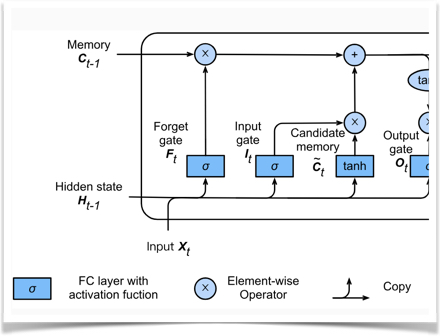

<div align="left">
  
</div>

# D2L.ai: Buku interaktif *Deep Learning* Interactive dengan kode aneka *framework*, matematika dan diskusi

[](http://ci.d2l.ai/job/d2l-en/job/master/)

[Website buku](https://d2l.ai/) | [Kelas STAT 157 di UC Berkeley, Spring 2019](http://courses.d2l.ai/berkeley-stat-157/index.html) | Versi terbaru: v0.16.1

<h5 align="center"><i>Cara terbaik untuk memahami *deep learning* adalah dengan praktik.</i></h5>

<p align="center">
  
  
  
  
</p>

Buku sumber terbuka ini adalah upaya kami untuk membuat deep learning mudah didekati, mengajarkan anda konsep, konteks dan kode. Seluruh buku ini disusun dalam *Jupyter notebook*, menggabungkan gambar, matematika dan contoh interaktif dengan kode mandiri.

Tujuan kami adalah menawarkan sumberdaya yang dapat
1. tersedia secara bebas untuk siapa saja;
1. menawarkan kedalaman teknis yang memadai untuk menjadi titik awal dari perjalanan untuk menjadi ilmuwan *machine learning* terapan yang sebenarnya;
1. menyertakan kode yang dapat dijalankan, menunjukkan kepada pembaca bagaimana memecahkan masalah dalam praktik;
1. memungkinkan pemutakhiran cepat, baik oleh kami dan juga oleh komunitas pada umumnya;
1. dilengkapi dengan forum diskusi interaktif tentang detail teknis dan untuk menjawab pertanyaan.

## Universitas yang memakai D2L
<p align="center">
  
</p>

## Makalah Keren Menggunakan D2L

1. [**Universal Average-Case Optimality of Polyak Momentum**](https://arxiv.org/pdf/2002.04664.pdf). D. Scieur, F. Pedregosan. *International Conference on Machine Learning, 2020*

1. [**2D Digital Image Correlation and Region-Based Convolutional Neural Network in Monitoring and Evaluation of Surface Cracks in Concrete Structural Elements**](https://www.mdpi.com/1996-1944/13/16/3527/pdf). M. Słoński, M. Tekieli. *Materials, 2020*

1. [**GluonCV and GluonNLP: Deep Learning in Computer Vision and Natural Language Processing**](https://www.jmlr.org/papers/volume21/19-429/19-429.pdf). J. Guo, H. He, T. He, L. Lausen, M. Li, H. Lin, X. Shi, C. Wang, J. Xie, S. Zha, A. Zhang, H. Zhang, Z. Zhang, Z. Zhang, S. Zheng, and Y. Zhu. *Journal of Machine Learning Research, 2020*

1. [**Detecting Human Driver Inattentive and Aggressive Driving Behavior Using Deep Learning: Recent Advances, Requirements and Open Challenges**](https://ieeexplore.ieee.org/stamp/stamp.jsp?arnumber=9107077). M. Alkinani, W. Khan, Q. Arshad. *IEEE Access, 2020*

1. [**Diagnosing Parkinson by Using Deep Autoencoder Neural Network**](https://link.springer.com/chapter/10.1007/978-981-15-6325-6_5). U. Kose, O. Deperlioglu, J. Alzubi, B. Patrut. *Deep Learning for Medical Decision Support Systems, 2020*

<details><summary>lebih</summary>

1. [**Descending through a Crowded Valley--Benchmarking Deep Learning Optimizers**](https://arxiv.org/pdf/2007.01547.pdf). R. Schmidt, F. Schneider, P. Hennig.

1. [**Deep Learning Architectures for Medical Diagnosis**](https://link.springer.com/chapter/10.1007/978-981-15-6325-6_2). U. Kose, O. Deperlioglu, J. Alzubi, B. Patrut. *Deep Learning for Medical Decision Support Systems, 2020*

1. [**ControlVAE: Tuning, Analytical Properties, and Performance Analysis**](https://arxiv.org/pdf/2011.01754.pdf). H. Shao, Z. Xiao, S. Yao, D. Sun, A. Zhang, S. Liu, T. Abdelzaher.

1. [**Potential, challenges and future directions for deep learning in prognostics and health management applications**](https://reader.elsevier.com/reader/sd/pii/S0952197620301184?token=7261E56B97513C5D621B9B5F43CAABEC2860AE3036278C3E5264707C32DCB658077B2AFA6ED6D5CD0FB7B16770828080). O. Fink, Q. Wang, M. Svensén, P. Dersin, W-J. Lee, M. Ducoffe. *Engineering Applications of Artificial Intelligence, 2020*

1. [**Learning User Representations with Hypercuboids for Recommender Systems**](https://arxiv.org/pdf/2011.05742.pdf). S. Zhang, H. Liu, A. Zhang, Y. Hu, C. Zhang, Y. Li, T. Zhu, S. He, W. Ou. *ACM International Conference on Web Search and Data Mining, 2021*

</details>


Jika menurut Anda buku ini bermanfaat, beri bintang (★) untuk repositori ini atau kutip buku ini menggunakan entri bibtex berikut:

```
@book{zhang2020dive,
    title={Dive into Deep Learning},
    author={Aston Zhang and Zachary C. Lipton and Mu Li and Alexander J. Smola},
    note={\url{https://d2l.ai}},
    year={2020}
}
```


## Dukungan

> <p>"Dalam waktu kurang dari satu dekade, revolusi AI telah menyapu dari laboratorium riset ke banyak industri dan ke setiap sudut kehidupan kita sehari-hari. *Dive into Deep Learning* adalah teks yang sangat bagus tentang *deep learning* dan layak mendapat perhatian dari siapa saja yang ingin mempelajari mengapa *deep learning* memicu revolusi AI: kekuatan teknologi paling kuat di zaman kita. "</p>
> <b>&mdash; Jensen Huang, Founder and CEO, NVIDIA</b>

> <p>"Ini adalah buku yang tepat waktu dan menarik, menyediakan tidak hanya gambaran umum yang komprehensif tentang prinsip-prinsip *deep learning* tetapi juga detail algoritma dengan kode pemrograman, dan terlebih lagi, pengantar mutakhir untuk *deep learning* dalam *computer vision* dan *natural language processing*. Selami buku ini jika Anda ingin mendalami *deep learning*!"</p>
> <b>&mdash; Jiawei Han, Michael Aiken Chair Professor, University of Illinois at Urbana-Champaign</b>

> <p>"Ini adalah tambahan yang sangat disambut baik untuk literatur *machine learning*, dengan fokus pada pengalaman langsung melalui notebook Jupyter. Siswa *deep learning* akan menganggap ini sangat berharga untuk menjadi mahir di bidang ini."</p>
> <b>&mdash; Bernhard Schölkopf, Director, Max Planck Institute for Intelligent Systems</b>

## Berkontribusi ([Pelajari Caranya](https://d2l.ai/chapter_appendix-tools-for-deep-learning/contributing.html))

Buku sumber terbuka ini telah 

Buku sumber terbuka ini mendapatkan keuntungan dari saran pedagogis, koreksi kesalahan ketik, dan perbaikan lainnya dari kontributor komunitas. Bantuan Anda sangat berharga untuk menjadikan buku ini lebih baik bagi semua orang.

**Hi [D2L contributors](https://github.com/d2l-ai/d2l-en/graphs/contributors), tolong email GitHub ID dan nama Anda ke d2lbook.en AT gmail DOT com agar nama Anda bisa tampil di halaman [acknowledgments](https://d2l.ai/chapter_preface/index.html#Acknowledgments). Terimakasih.**

## Ringkasan Lisensi

Buku sumber terbuka ini tersedia di bawah Lisensi Internasional Creative Commons Attribution-ShareAlike 4.0. Lihat file [LISENSI](LISENSI).

Contoh dan kode referensi dalam buku sumber terbuka ini tersedia di bawah lisensi MIT yang dimodifikasi. Lihat file [LICENSE-SAMPLECODE](LICENSE-SAMPLECODE).


[Versi bahasa Cina](https://github.com/d2l-ai/d2l-zh) | [Diskusi dan laporkan masalah](https://discuss.d2l.ai/) | [Kode Etik](CODE_OF_CONDUCT.md) | [Informasi Lain](INFO.md)