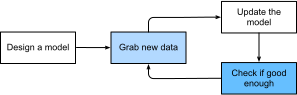

# Pengantar
:label:`chap_introduction`

Hingga saat ini, hampir setiap program komputer yang berinteraksi dengan kita 
setiap hari diprogram oleh pengembang perangkat lunak dari prinsip pertama. 
Misalnya kita ingin membuat aplikasi untuk mengelola platform *e-commerce*. 
Setelah berdiri di sekitar papan tulis selama beberapa jam untuk merenungkan masalah tersebut, 
kita akan menemukan garis besar solusi yang mungkin terlihat seperti ini: 
(i) pengguna berinteraksi dengan aplikasi melalui antarmuka yang berjalan di 
browser web atau aplikasi seluler; (ii) aplikasi kita berinteraksi dengan database kelas komersial
untuk melacak setiap status pengguna dan menyimpan catatan transaksi historis; 
dan (iii) inti dari aplikasi kita, logika bisnis (bisa dikatakan, otak) aplikasi
kita menjabarkan secara metodis tindakan yang tepat yang harus dilakukan 
oleh program kita dalam setiap kemungkinan situasi.

Untuk membangun otak aplikasi kita,
kita harus memikirkan setiap kasus yang kita pikir memungkinkan 
untuk membuat aturan yang sesuai.
Setiap kali pelanggan mengklik untuk menambahkan barang ke 
keranjang belanja mereka,
kita menambahkan data ke tabel database keranjang belanja,
mengaitkan ID pengguna tersebut dengan ID produk yang diminta.
Sementara beberapa pengembang pernah melakukannya dengan benar
pada kali pertama (mungkin perlu beberapa uji coba untuk mengatasi masalah),
Pada umumnya, kita dapat menulis program seperti itu dari
prinsip-prinsip pertama dan meluncurkannya dengan percaya diri
bahkan *sebelum* kita melihat pelanggan sungguhan.
Kemampuan kita untuk merancang sistem otomatis dari prinsip pertama
yang menjalankan produk dan sistem,
sering dalam situasi baru,
adalah prestasi kognitif yang luar biasa.
Dan saat Anda dapat menemukan solusi yang berhasil $100\%$ setiap saat,
Anda tidak perlu menggunakan pembelajaran mesin.

Untungnya bagi komunitas ilmuwan pembelajaran mesin yang terus bertambah,
banyak tugas yang ingin kami otomatisasi namun tidak mudah ditundukkan dengan 
kecerdikan manusia. Bayangkan berdiri di sekitar papan tulis dengan orang 
terpintar yang Anda ketahui, tetapi kali ini Anda mencoba 
menyelesaikan salah satu masalah berikut:

* Membuat program yang meramal cuaca besok berdasarkan informasi geografis, citra satelit, dan jendela jejak cuaca masa lalu.
* Membuat program yang memuat pertanyaan, dalam bentuk teks bebas, dan dapat menjawabnya dengan benar.
* Membuat program yang ketika diberi gambar dapat mengenali semua orang di dalam gambar, dan menggambar *outline* di sekelilingnya.
* Membuat program yang menyarankan produk yang kemungkinan besar akan disukai pengguna, namun jarang ditemui secara alami ketika *browsing* di web.


Dalam setiap contoh masalah ini, bahkan programmer elit
tidak mampu membuat kode dari nol.
Alasannya bisa bermacam-macam. Terkadang program
yang dikerjakan mengikuti pola yang terus berubah seiring waktu,
dan kita membutuhkan program yang adapat beradaptasi.
Dalam kasus lain, relasi (misalnya antara piksel,
dan kategori abstrak) mungkin terlalu rumit,
membutuhkan ribuan atau jutaan perhitungan
yang berada di luar pemahaman kita 
walaupun mata kita bisa mengerjakan tugas itu dengan mudah.
pembelajaran mesin adalah studi tentang teknik efektif yang 
mampu belajar dari pengalaman.
Saat algoritma pembelajaran mesin mengumpulkan lebih banyak 
pengalaman, biasanya dalam bentuk data observasi atau
interaksi dengan lingkungan, kinerjanya akan meningkat.
Bandingkan ini dengan platform e-commerce deterministik di awal tadi,
yang bekerja sesuai dengan logika bisnis yang tetap sama,
tidak peduli berapa banyak pengalaman yang diperoleh,
sampai pemrogram belajar dan memutuskan sendiri
bahwa sudah waktunya untuk memutakhirkan perangkat lunaknya.
Dalam buku ini, kami akan mengajari Anda dasar-dasar pembelajaran mesin,
dan fokus khususnya pada pembelajaran mendalam,
kumpulan teknik yang kuat yang 
mendorong inovasi di berbagai bidang seperti visi komputer,
pemrosesan bahasa alami, perawatan kesehatan, dan genomik.


## Contoh yang Memotivasi

Sebelum mulai menulis, penulis buku ini,
seperti banyak tenaga kerja, harus berkafein.
Kami melompat ke dalam mobil dan mulai mengemudi.
Menggunakan iPhone, Alex memanggil "Hai Siri",
membangunkan sistem pengenalan suara telepon.
Kemudian Mu memerintahkan "arah ke kedai kopi Blue Bottle".
Telepon dengan cepat menampilkan transkripsi perintahnya.
Ia juga menyadari bahwa kami menanyakan arah
dan meluncurkan aplikasi Maps (aplikasi)
untuk memenuhi permintaan kami.
Setelah diluncurkan, aplikasi Maps mengidentifikasi sejumlah rute.
Di samping setiap rute, ponsel menampilkan perkiraan waktu transit.
Walaupun kami mengarang cerita ini untuk ilustrasi pedagogis,
cerita ini menunjukkan bahwa hanya dalam beberapa detik,
interaksi sehari-hari kita dengan ponsel pintar
dapat melibatkan beberapa model pembelajaran mesin. 

Bayangkan membuat program yang menjawab kata panggilan
seperti "Alexa", "Ok Google", dan "Hai Siri".
Coba buat kode sendiri di ruangan
hanya dengan komputer dan editor kode,
seperti yang diilustrasikan dalam :numref:`fig_wake_word`.
Bagaimana Anda akan menulis program seperti itu dari prinsip pertama?
Pikirkanlah ... masalah ini sulit.
Setiap detik, mikrofon akan mengoleksi sekitar 
44000 sampel.
Setiap sampel merupakan pengukuran amplitudo gelombang suara.
Aturan apa yang dapat dipetakan dengan andal dari cuplikan audio mentah ke prediksi yang meyakinkan
$\{\text{yes}, \text{no}\}$
apakah cuplikan tersebut berisi kata panggilan?
Jika Anda bingung, jangan khawatir.
Kami juga tidak tahu bagaimana menulis program seperti itu dari nol.
Itulah mengapa kami menggunakan pembelajaran mesin.


:label:`fig_wake_word`

Inilah triknya.
Seringkali, bahkan ketika kita tidak tahu bagaimana cara memberitahu komputer
secara eksplisit bagaimana memetakan dari input ke output,
kita tetap mampu melakukan prestasi kognitif itu sendiri.
Dengan kata lain, meskipun Anda tidak tahu
bagaimana memprogram komputer untuk mengenali kata "Alexa",
Anda sendiri bisa mengenalinya.
Berbekal kemampuan ini, kita dapat mengumpulkan *dataset* yang sangat besar
berisi contoh-contoh audio
dan beri label pada contoh audio tersebut yang mengandung 
kata panggilan atau tidak mengandung kata panggilan.
Dalam pendekatan pembelajaran mesin,
kita tidak mencoba merancang sistem
*secara eksplisit* untuk mengenali kata panggilan.
Sebaliknya, kita mendefinisikan program fleksibel
yang perilakunya ditentukan oleh sejumlah *parameter*.
Kemudian kita menggunakan *dataset* untuk menentukan kumpulan parameter terbaik,
yang meningkatkan kinerja program kita menurut beberapa ukuran kinerja yang relevan.

Anda dapat menganggap parameter sebagai kenop yang dapat kita putar untuk 
memanipulasi perilaku program.
Bersama dengan parameter yang sudah ditentukan, kami menyebut 
program ini sebagai *model*.
Himpunan semua program yang berbeda (pemetaan input ke output)
yang dapat kami hasilkan hanya dengan memanipulasi parameter
disebut *keluarga* model.
Dan program meta yang menggunakan dataset kita 
untuk memilih parameter terbaik disebut algoritma *learning*.

Sebelum kita dapat melanjutkan dan menggunakan algoritma *learning*,
kita harus mendefinisikan masalahnya dengan tepat,
menjabarkan sifat input dan output yang tepat,
dan memilih keluarga model yang sesuai.
Pada kasus ini,
model kita menerima potongan audio sebagai *input*,
dan modelnya
menghasilkan pilihan di antara
$\{\text{yes}, \text{no}\}$ as *output*.
Jika semua berjalan sesuai rencana
tebakan model 
biasanya akan benar untuk
menjawab pertanyaan apakah cuplikan audio tersebut berisi kata panggilan.

Jika kita memilih keluarga model yang tepat,
seharusnya akan ada pengaturan kenop
sedemikian rupa sehingga model menjawab "ya" setiap kali
mendengar kata "Alexa".
Karena pilihan dari kata panggilan itu bebas,
kita mungkin membutuhkan keluarga model yang cukup fleksibel, sehingga 
melalui pengaturan kenop yang lain, model itu bisa menjawab "ya"
hanya setelah mendengar kata "Aprikot".
Kami berharap keluarga model yang sama harus cocok
untuk pengenalan kata "Alexa" dan pengenalan kata "Aprikot"
karena mereka tampaknya, secara intuitif, adalah tugas yang mirip.
Namun, kita mungkin membutuhkan keluarga model yang sama sekali berbeda
jika kita ingin berurusan dengan input atau output yang
berbeda secara mendasar,
katakanlah jika kita ingin memetakan dari gambar ke teks,
atau dari kalimat bahasa Inggris ke kalimat bahasa Mandarin.

Seperti yang bisa Anda duga, jika kita mengatur semua kenop secara acak,
kecil kemungkinan model kita akan mampu mengenali kata "Alexa",
"Apricot", atau kata bahasa Inggris lainnya.
Dalam pembelajaran mesin,
*learning* adalah proses untuk menemukan pengaturan kenop yang tepat agar 
menghasilkan perilaku yang diinginkan dari model kita.
Dengan kata lain, kita *melatih* model kita dengan data.
Seperti yang ditunjukkan di :numref:`fig_ml_loop`, proses 
pelatihan biasanya terlihat seperti berikut:

1. Mulailah dengan model yang diinisialisasi secara acak yang tidak dapat melakukan sesuatu yang berguna.
1. Ambil beberapa data Anda (mis., Cuplikan audio dan label $\{\text{yes}, \text{no}\}$ yang sesuai).
1. Sesuaikan kenop sehingga model menjadi lebih baik terhadap contoh-contoh tersebut.
1. Ulangi Langkah 2 dan 3 sampai modelnya sangat baik.


:label:`fig_ml_loop`

Ringkasnya, daripada membuat kode pengenal kata panggilan,
kita membuat kode program yang dapat *belajar* untuk mengenali kata-kata panggilan 
jika kita berikan *dataset* besar berlabel.
Anda dapat menyebut cara ini, untuk menentukan perilaku program
dengan memberikan dengan *dataset* sebagai pemrograman dengan data.
Artinya, kita bisa "memprogram" detektor kucing dengan memberikan 
banyak contoh kucing dan anjing ke sistem pembelajaran mesin kita.
Dengan cara ini detektor pada akhirnya akan belajar mengeluarkan bilangan positif 
yang sangat besar jika itu adalah kucing, bilangan negatif yang sangat
besar jika itu adalah seekor anjing,
dan mendekati nol jika tidak yakin,
dan contoh ini hanya sebagian kecil saja dari apa yang bisa dilakukan pembelajaran mesin.
*Deep learning*, yang akan kami jelaskan lebih detail nanti,
hanyalah satu di antara banyak metode populer
untuk memecahkan masalah pembelajaran mesin.

## Komponen-komponen kunci

Dalam contoh kata panggilan tadi, kami menjelaskan kumpulan data
terdiri dari potongan audio dan label biner,
dan kami
menjelaskan secara garis besar tentang bagaimana kita bisa melatih
model untuk memperkirakan pemetaan dari cuplikan audio hingga klasifikasi.
Masalah seperti ini, memprediksi label yang tidak diketahui 
berdasarkan suatu masukan, 
berdasarkan *dataset* yang terdiri dari contoh
yang labelnya diketahui,
disebut *supervised* pembelajaran mesin.
Ini hanyalah salah satu dari banyak jenis masalah pembelajaran mesin.
Nanti kita akan mempelajari berbagai masalah pembelajaran mesin.
Pertama, kami ingin menjelaskan lebih banyak tentang beberapa komponen inti
yang akan mengikuti kita, apa pun masalah pembelajaran mesin yang kita hadapi:

1. *Data* yang dapat kita pelajari.
1. *Model* tentang bagaimana mentransformasikan data.
1. Fungsi objektif yang mengukur seberapa baik (atau buruk) kinerja sebuah model.
1. Algoritma untuk menyesuaikan parameter model untuk mengoptimalkan fungsi objektif.

### Data

Mungkin sudah jelas bahwa Anda tidak dapat melakukan pekerjaan ilmu data tanpa data.
Kami bisa kehilangan ratusan halaman memikirkan apa sebenarnya yang dimaksud dengan data,
tapi untuk saat ini, kita akan mengutamakan pada sisi praktisnya
dan fokus pada properti utama yang akan diperhatikan.
Secara umum, kita berbicara mengenai kumpulan contoh.
Untuk bekerja dengan data,
kita biasanya
perlu memikirkan representasi numerik yang sesuai dari data tersebut.
Setiap *contoh* (atau *titik data*, *contoh data*) biasanya terdiri dari satu set
atribut yang disebut *fitur* (atau *kovariat*),
yang darinya model harus membuat prediksi.
Dalam masalah *supervised learning* di atas,
hal yang akan diprediksi
adalah atribut khusus
yang ditetapkan sebagai
*label* (atau *target*).

Jika kita bekerja dengan data gambar,
setiap foto individu dapat menjadi contoh,
masing-masing diwakili oleh daftar nilai numerik yang diurutkan
sesuai dengan kecerahan setiap piksel.
Foto berwarna ukuran $200\times 200$ terdiri dari $200\times200\times3=120000$ nilai numerik
sesuai dengan tingkat kecerahan warna merah, hijau dan biru dari setiap lokasi spasial.
Dalam tugas tradisional lainnya, kita mungkin mencoba memprediksi
apakah pasien akan selamat atau tidak,
ketika diberi satu set fitur standar seperti
usia, tanda-tanda vital, dan diagnosis.

Ketika setiap contoh dicirikan oleh nilai numerik dalam jumlah yang sama,
kita katakan bahwa data terdiri dari vektor dengan panjang tetap
dan kami menjelaskan panjang konstan vektor
sebagai *dimensionalitas* data.
Seperti yang Anda bisa duga, vektor dengan panjang tetap bisa menjadi properti yang memudahkan.
Jika kita ingin melatih model untuk mengenali kanker dalam gambar mikroskop,
input dengan panjang tetap berarti kita tidak harus menghawatirkan hal ini.

Namun, tidak semua data dapat dengan mudah direpresentasikan sebagai
vektor dengan panjang tetap.
Meskipun kita mungkin mengharapkan gambar mikroskop berasal dari peralatan standar,
kita tidak dapat mengharapkan semua gambar yang diambil dari Internet
memiliki resolusi atau bentuk yang sama.
Untuk gambar, kita mungkin bisa memangkas semuanya ke ukuran standar,
tapi strategi itu hanya membantu kita sejauh ini.
Cara ini berisiko kehilangan informasi dalam bagian yang dipotong.
Selain itu, data berupa teks lebih jarang lagi untuk dijadikan dalam panjang yang tetap.
Perhatikan ulasan pelanggan yang ditinggalkan di situs *e-commerce*
seperti Amazon, IMDB, dan TripAdvisor.
Beberapa ada yang pendek: "bau!".
Beberapa yang lain menulis dalam banyak halaman.
Salah satu keuntungan utama dari pembelajaran mendalam dibandingkan metode tradisional
adalah kemampuannya dalam menangani data dengan panjang bervariasi.

Umumnya, semakin banyak data yang kita miliki, semakin mudah pekerjaan kita.
Saat kita memiliki lebih banyak data, kita dapat melatih model yang lebih canggih
dan tidak terlalu mengandalkan asumsi-asumsi dari model.
Perubahan rezim dari (secara komparatif) data kecil menjadi data besar (*big data*)
adalah kontributor utama bagi keberhasilan pembelajaran mendalam modern.
Poinnya adalah, banyak model paling menarik dalam pembelajaran mendalam
tidak akan berfungsi tanpa *dataset* yang besar.
Beberapa model pembelajaran mendalam lainnya ada yang bisa berfungsi dalam rezim data kecil,
tetapi tidak lebih baik dari pendekatan tradisional.

Terakhir, tidak cukup hanya memiliki banyak data dan 
memprosesnya dengan cerdik.
Kami membutuhkan data *yang benar*.
Jika datanya penuh dengan kesalahan,
atau jika fitur yang dipilih tidak berguna untuk prediksi target yang dituju,
maka proses *learning* tidak akan berhasil.
Situasi ini digambarkan dengan baik oleh: *garbage in, garbage out*.
Selain itu, kinerja prediksi yang buruk bukan satu-satunya masalah yang akan timbul.
Dalam penerapan pembelajaran mesin yang sensitif,
seperti kepolisian prediktif, penyaringan resume kandidat, dan 
model risiko yang digunakan untuk peminjaman,
kita harus sangat waspada terhadap konsekuensi data sampah.
Satu kesalahan yang umum terjadi di *dataset* di mana beberapa kelompok orang
tidak terwakili dalam data pelatihan.
Bayangkan menerapkan sistem pengenalan kanker kulit di alam liar
yang belum pernah melihat kulit hitam sebelumnya.
Kegagalan juga bisa terjadi saat data
tidak hanya kurang merepresentasikan beberapa kelompok
tetapi juga mencerminkan prasangka sosial.
Sebagai contoh,
jika keputusan perekrutan di masa lalu digunakan untuk melatih model prediktif
yang akan digunakan untuk menyaring resume kandidat,
maka model pembelajaran mesin bisa secara tidak sengaja
memasukkan dan mengotomatiskan ketidakadilan historis.
Perhatikan bahwa ini semua dapat terjadi tanpa sang ilmuwan data secara aktif 
berniat melakukan itu, atau bahkan tanpa disadarinya.

### Model

Sebagian besar pembelajaran mesin melibatkan suatu transformasi data dalam arti tertentu.
Kita mungkin ingin membangun sistem yang menerima input foto dan memprediksi kadar senyuman.
Dalam hal lain, kita mungkin ingin menrima input satu set pembacaan sensor
dan memprediksi seberapa normal vs anomali pembacaan tersebut.
Dengan menyebut model, yang kami maksudkan adalah mesin komputasi untuk menyerap data
dari satu jenis,
dan mengeluarkan prediksi dari jenis yang mungkin berbeda.
Secara khusus, kita tertarik pada model statistik
yang dapat diperkirakan dari data.
Walaupun model sederhana sangat mampu menangani
masalah yang cukup sederhana,
masalah
yang kami fokuskan dalam buku ini di luar kapasitas metode klasik.
*Deep learning* dibedakan dari pendekatan klasik
terutama oleh serangkaian model yang kuat yang menjadi fokusnya.
Model ini terdiri dari banyak transformasi data yang berurutan
yang dirangkai dari atas ke bawah, itulah kenapa dinamakan pembelajaran mendalam.
Dalam perjalanan kita untuk mendiskusikan *deep model*,
kami juga akan membahas beberapa metode tradisional.

### Fungsi Objektif

Di awal, kami memperkenalkan pembelajaran mesin sebagai pembelajaran dari pengalaman.
Dengan menyebut *learning* di sini, yang kami maksud adalah meningkatkan beberapa tugas seiring waktu.
Tetapi siapa yang bisa mengatakan bahwa itu adalah kemajuan atau perbaikan?
Anda mungkin membayangkan bahwa kita dapat mengusulkan untuk memperbarui model kita,
dan beberapa orang mungkin tidak setuju bahwa usulan perbaruan itu adalah kemajuan atau kemunduran.

Untuk mengembangkan sistem matematika formal dari mesin pembelajaran,
kita perlu memiliki ukuran formal tentang seberapa baik (atau buruk) model kita.
Dalam pembelajaran mesin, dan pengoptimalan secara umum,
kami menyebutnya *fungsi objektif*.
Secara konvensi, kami biasanya mendefinisikan fungsi objektif sehingga nilai yang lebih rendah adalah lebih baik.
Ini hanyalah konvensi.
Anda dapat mengambil fungsi apa pun
yang nilainya lebih tinggi adalah yang lebih baik, dan mengubahnya menjadi fungsi baru
yang identik secara kualitatif tetapi nilai yang lebih rendah adalah lebih baik
dengan cara membalik tanda positif dan negatifnya.
Karena lebih rendah lebih baik, fungsi-fungsi ini terkadang disebut
*fungsi kerugian*.

Saat mencoba memprediksi nilai numerik,
fungsi kerugian yang paling umum adalah *kesalahan kuadrat*,
yaitu, kuadrat dari perbedaan antara prediksi dan nilai yang sebenarnya.
Untuk klasifikasi, fungsi objektif paling umum adalah meminimalkan tingkat kesalahan,
yaitu, bagian dari contoh yang
prediksinya tidak sesuai dengan nilai sebenarnya.
Beberapa objektif (misalnya, kesalahan kuadrat) mudah untuk dioptimalkan.
Lainnya (misalnya, tingkat kesalahan) sulit untuk dioptimalkan secara langsung,
karena tidak dapat dibedakan atau komplikasi lainnya.
Dalam kasus ini, biasanya mengoptimalkan fungsi objektif *surrogate*.

Biasanya, fungsi kerugian ditentukan
sehubungan dengan parameter model
dan bergantung pada *dataset*.
Kita belajar
nilai terbaik dari parameter model kita
dengan meminimalkan kerugian yang terjadi pada satu set
terdiri dari sejumlah contoh yang dikumpulkan untuk pelatihan.
Namun, melakukannya dengan baik pada data pelatihan
tidak menjamin bahwa model kita akan bekerja dengan baik pada data yang baru.
Jadi kita biasanya ingin membagi data yang tersedia menjadi dua partisi:
*dataset* pelatihan (atau *set* pelatihan, untuk menyesuaikan parameter model)
dan *dataset* pengujian (atau *set* pengujian, yang diadakan untuk evaluasi),
dan kita akan menghitung kinerja model pada keduanya.
Anda bisa membayangkan performa latihan seperti itu
nilai siswa pada latihan ujian 
digunakan untuk mempersiapkan beberapa ujian akhir yang sebenarnya.
Meskipun hasil latihan ujian bagus,
itu tidak menjamin kesuksesan pada ujian akhir.
Dengan kata lain,
kinerja tes dapat menyimpang secara signifikan dari kinerja pelatihan.
Saat model berperforma baik di set pelatihan
tetapi gagal menggeneralisasi ke data yang baru,
kita mengatakan itu sebagai *overfitting*.
Dalam istilah kehidupan nyata, ini seperti gagal dalam ujian yang sebenarnya
meski mengerjakan latihan ujian dengan baik.

### Algoritma Optimasi

Setelah kita mendapatkan beberapa sumber data dan representasi,
model, dan fungsi objektif yang terdefinisi dengan baik,
kita membutuhkan algoritma yang mampu melakukan pencarian
untuk mendapatkan parameter terbaik untuk meminimalkan fungsi kerugian.
Algoritma optimasi populer untuk pembelajaran mendalam
didasarkan pada pendekatan yang disebut *gradient descent*.
Singkatnya, di setiap langkah, metode ini
akan mencari, untuk setiap parameter,
ke arah mana kerugian set pelatihan akan bergerak
jika Anda mengubah parameter itu sedikit saja.
Kemudian dia akan memperbarui
parameter ke arah yang dapat mengurangi kerugian.

## Jenis Masalah *Machine Learning*

Masalah kata panggilan dalam contoh motivasi di awal 
hanyalah satu di antara
banyak masalah yang dapat ditangani oleh pembelajaran mesin.
Untuk memotivasi pembaca lebih lanjut
dan memberi kita beberapa bahasa umum saat kita
membicarakan lebih banyak masalah di seluruh buku,
berikut kami
buat daftar contoh masalah pembelajaran mesin.
Kami akan terus merujuk
konsep kami yang disebutkan di atas
seperti data, model, dan teknik pelatihan.

### Pembelajaran Terawasi *Supervised Learning*

*Pembelajaran terawasi* membahas tugas
memprediksi label dari masukan berupa fitur.
Setiap pasangan fitur - label disebut sebagai contoh.
Terkadang, jika konteksnya jelas, kami mungkin menggunakan istilah *contoh*
untuk merujuk pada kumpulan masukan,
bahkan ketika label terkait tidak diketahui.
Tujuan kita adalah menghasilkan model
yang memetakan input apa pun ke prediksi label.

Untuk mendasari deskripsi ini dalam contoh konkret,
jika kita bekerja di bidang kesehatan,
maka kita mungkin ingin memprediksi apakah atau tidak
seorang pasien akan mengalami serangan jantung.
Pengamatan ini, "serangan jantung" atau "tidak ada serangan jantung",
akan menjadi label kita.
Fitur masukan mungkin merupakan tanda vital
seperti detak jantung, tekanan darah diastolik,
dan tekanan darah sistolik.

Pengawasan berperan karena untuk memilih parameter, 
kita (sebagai pengawas) menyediakan model dengan *dataset*
terdiri dari contoh berlabel,
di mana setiap contoh dicocokkan dengan label yang benar.
Dalam istilah probabilistik, kami biasanya tertarik untuk memperkirakan
probabilitas bersyarat dari label yang diberi fitur masukan.
Meskipun ini hanyalah salah satu dari beberapa paradigma dalam pembelajaran mesin,
pembelajaran terawasi termasuk sebagai mayoritas dalam hal
 kesuksesan penerapan pembelajaran mesin di industri.
Sebagian karena banyak tugas penting
dapat digambarkan secara jelas sebagai memperkirakan probabilitas
dari sesuatu yang tidak diketahui berdasarkan kumpulan data tertentu yang tersedia:

* Memprediksi kanker vs. bukan kanker berdasarkan masukan gambar tomografi komputer.
* Memprediksi terjemahan yang benar dalam bahasa Prancis berdasarkan masukan kalimat dalam bahasa Inggris.
* Memprediksi harga suatu saham bulan depan berdasarkan data pelaporan keuangan bulan ini.

Bahkan dengan deskripsi yang sederhana
"memprediksi label berdasarkan fitur masukan"
pembelajaran yang diawasi dapat berupa banyak bentuk
dan membutuhkan banyak keputusan pemodelan,
tergantung pada (di antara pertimbangan lain) jenis, ukuran,
dan jumlah input dan output.
Misalnya, kita menggunakan model yang berbeda untuk
 memproses urutan masukan dengan panjang bervariasi 
dan untuk memproses representasi vektor dengan panjang tetap.
Kita akan membahas banyak dari masalah ini secara mendalam
sepanjang buku ini.

Secara informal, proses pembelajaran terlihat seperti berikut ini.
Pertama, ambil banyak koleksi contoh yang fitur-fiturnya diketahui
dan pilih sebagian di antaranya secara acak,
dapatkan label yang sebenarnya untuk masing-masing contoh tersebut.
Terkadang label ini mungkin data yang telah dikumpulkan
(misalnya, apakah pasien meninggal dalam tahun berikutnya?)
dan di lain waktu kita mungkin perlu menggunakan usaha manusia 
untuk memberi label pada data,
(mis., menetapkan gambar ke kategori).
Bersama-sama, masukan dan label yang sesuai membentuk suatu set pelatihan.
Kita kemudian memasukkan set data pelatihan ke dalam algoritma pembelajaran yang diawasi,
sebuah fungsi yang mengambil masukan dari sebuah dataset
dan menghasilkan fungsi lain: yaitu model yang dipelajari dari data.
Akhirnya, kita dapat memasukkan masukan yang sebelumnya tidak 
pernah dilihat ke model yang dipelajari,
menggunakan keluarannya sebagai prediksi dari label yang sesuai.
Proses lengkapnya diambil dalam :numref:`fig_supervised_learning`.

#### Regresi

Mungkin tugas belajar terbimbing yang paling sederhana
dan mudah untuk dipahami *regresi*.
Pertimbangkan, misalnya, sekumpulan data yang diambil
dari basis data penjualan rumah.
Kita mungkin membuat tabel,
di mana setiap baris sesuai dengan rumah yang berbeda,
dan setiap kolom sesuai dengan beberapa atribut yang relevan,
seperti ukuran luas sebuah rumah,
jumlah kamar tidur, jumlah kamar mandi, dan jumlah menit (berjalan kaki) ke pusat kota.
Dalam kumpulan data ini, setiap contoh adalah suatu rumah tertentu,
dan vektor fitur yang sesuai akan menjadi satu baris dalam tabel.
Jika Anda tinggal di New York atau San Francisco,
dan Anda bukan CEO Amazon, Google, Microsoft, atau Facebook,
(luas, jumlah kamar tidur, jumlah kamar mandi, jarak berjalan kaki)
vektor fitur untuk rumah Anda mungkin terlihat seperti ini: $[600, 1, 1, 60]$.
Namun, jika Anda tinggal di Pittsburgh, mungkin terlihat seperti $[3000, 4, 3, 10]$.
Vektor fitur seperti ini sangat penting
untuk sebagian besar algoritma pembelajaran mesin klasik.

Apa yang membuat suatu masalah menjadi tergolong masalah regresi sebenarnya adalah keluarannya.
Katakanlah Anda sedang mencari rumah baru.
Anda mungkin ingin memperkirakan nilai pasar wajar sebuah rumah,
berdasarkan masukan beberapa fitur seperti di atas.
Label, harga jual, adalah nilai numerik.
Ketika label mengambil nilai numerik bebas,
kita menyebutnya sebagai masalah *regresi*.
Tujuan kita adalah menghasilkan model yang prediksinya 
mendekati nilai label sebenarnya.

Banyak masalah praktis merupakan masalah regresi yang dijelaskan dengan baik.
Memprediksi rating yang akan diberikan pengguna untuk sebuah film
dapat dianggap sebagai masalah regresi
dan jika Anda merancang algoritma hebat untuk mencapai prestasi ini di tahun 2009,
Anda mungkin telah memenangkan [hadiah Netflix senilai 1 juta dolar](https://en.wikipedia.org/wiki/Netflix_Prize).
Memprediksi lamanya pasien dirawat di rumah sakit
juga merupakan masalah regresi.
Aturan praktis yang baik untuk mengenali regresi adalah masalah yang menjawab *berapa?* sebaiknya menggunakan regresi,
seperti:

* Berapa jam operasi ini berlangsung?
* Berapa curah hujan yang akan terjadi di kota ini dalam enam jam ke depan?

Meskipun mungkin Anda belum pernah menggunakan pembelajaran mesin sebelumnya,
Anda mungkin telah menyelesaikan masalah regresi secara informal.
Bayangkan, misalnya, saluran air Anda diperbaiki
dan kontraktor Anda menghabiskan waktu 3 jam
menghilangkan kotoran dari pipa limbah Anda.
Kemudian dia mengirimi Anda tagihan sebesar 350 dolar.
Sekarang bayangkan teman Anda menyewa kontraktor yang sama selama 2 jam
dan bahwa dia menerima tagihan 250 dolar.
Jika seseorang kemudian bertanya kepada Anda berapa banyak tagihan 
untuk penghapusan kotoran mereka yang akan datang
Anda mungkin membuat beberapa asumsi yang masuk akal,
seperti lebih banyak jam kerja membutuhkan lebih banyak dolar.
Anda mungkin juga berasumsi bahwa ada beberapa tagihan dasar
dan kemudian kontraktor menagih per jam di luar itu.
Jika asumsi ini benar, maka jika diberikan dua contoh data ini,
Anda sudah dapat mengidentifikasi struktur harga kontraktor:
100 dolar per jam ditambah 50 dolar untuk muncul di rumah Anda.
Jika Anda mengerti sampai di sini maka Anda sudah mengerti
ide garis besar di balik regresi linier.

Dalam hal ini, kita dapat menghitung parameter model 
yang sama persis dengan harga kontraktor.
Terkadang hal ini tidak memungkinkan,
mis., jika beberapa dari
variansnya disebabkan oleh beberapa faktor
selain kedua fitur Anda.
Dalam kasus ini, kami akan mencoba mempelajari model
yang meminimalkan jarak antara prediksi kita dan nilai yang diamati.
Di sebagian besar bab, kita akan fokus pada
meminimalkan fungsi kerugian kesalahan kuadrat.
Seperti yang akan kita lihat nanti, kerugian ini sesuai dengan asumsi
bahwa data telah dirusak dengan gangguan Gaussian.

#### Klasifikasi

Meskipun model regresi bagus untuk menjawab pertanyaan *berapa?*,
banyak masalah yang tidak cocok dengan pola ini.
Sebagai contoh,
bank ingin menambahkan pemindaian cek ke aplikasi selulernya.
Ini akan melibatkan pelanggan yang mengambil foto cek
dengan kamera ponsel pintar mereka
dan aplikasi tersebut harus mampu
untuk secara otomatis memahami teks yang terlihat pada gambar.
Secara khusus,
aplikasi itu juga harus bisa memahami teks tulisan tangan agar lebih aman,
seperti memetakan karakter tulisan tangan
ke salah satu karakter yang dikenal.
Jenis masalah *yang mana?* ini disebut *klasifikasi*.
Masalah ini diselesaikan dengan sekumpulan algoritma yang berbeda
daripada yang digunakan untuk regresi meskipun banyak teknik akan sama. 

Dalam *klasifikasi*, kita ingin model kita melihat fitur,
mis., nilai piksel dalam gambar,
dan kemudian memprediksi *kategori* mana (secara formal disebut *kelas*),
Di antara beberapa pilihan yang berbeda, ada contohnya.
Untuk angka tulisan tangan, kita mungkin memiliki sepuluh kelas,
sesuai dengan angka 0 sampai 9.
Bentuk klasifikasi yang paling sederhana adalah jika hanya ada dua kelas,
masalah yang kami sebut *klasifikasi biner*.
Misalnya, kumpulan data kami dapat terdiri dari gambar hewan
dan label kita mungkin kelas $\mathrm{\{kucing, anjing\}}$.
Saat dalam regresi, kita mencari regressor untuk menghasilkan nilai numerik,
dalam klasifikasi, kami mencari pengklasifikasi, yang keluarannya adalah kelas yang diprediksi.

Untuk alasan yang akan kita bahas nanti di bagian yang lebih teknis,
mungkin sulit untuk mengoptimalkan model yang hanya dapat menghasilkan
tugas pengklasifikasian kategoris keras,
mis., "kucing" atau "anjing".
Dalam kasus ini, biasanya lebih mudah untuk diungkapkan
model kita dalam bahasa probabilitas.
Diberikan fitur contoh,
model kita memberikan probabilitas
untuk setiap kelas yang memungkinkan.
Kembali ke contoh klasifikasi hewan kita
dengan kelas $\mathrm{\{kucing, anjing\}}$,
pengklasifikasi mungkin melihat gambar dan mengeluarkan probabilitas
bahwa gambar kucing sebagai 0,9.
Kita dapat menafsirkan angka ini dengan mengatakan bahwa pengklasifikasi
90\% yakin bahwa gambar tersebut menggambarkan seekor kucing.
Besarnya probabilitas untuk kelas yang diprediksi
menyampaikan satu konsep tentang ketidakpastian.
Ini bukan satu-satunya konsep tentang ketidakpastian
dan kita akan membahas konsep lain di bab-bab mendatang.

Jika kita memiliki lebih dari dua kelas yang memungkinkan,
kita menyebutnya sebagai masalah *klasifikasi multikelas*.
Contoh umum termasuk pengenalan karakter tulisan tangan
$\mathrm{\{0, 1, 2, ... 9, a, b, c, ...\}}$.
Sementara kita menyelesaikan masalah regresi dengan mencoba
untuk meminimalkan fungsi kerugian kesalahan kuadrat,
fungsi kerugian umum untuk masalah klasifikasi disebut *entropi-silang*,
yang namanya akan dijelaskan
melalui pengantar teori informasi di bab-bab selanjutnya.

Perhatikan bahwa kelas yang paling mungkin belum tentu menjadi 
salah satu yang akan Anda gunakan dalam keputusan Anda.
Bayangkan bahwa Anda menemukan jamur yang indah di halaman belakang rumah Anda
seperti yang ditunjukkan di :numref:`fig_death_cap`.


:width:`200px`
:label:`fig_death_cap`

Sekarang, asumsikan bahwa Anda membuat pengklasifikasi dan melatihnya
untuk memprediksi apakah suatu jamur beracun berdasarkan foto.
Katakanlah pengklasifikasi pendeteksi racun kita menghasilkan keluaran 
bahwa kemungkinan foto 
:numref:`fig_death_cap` mengandung jamur *death cap* sebesar 0.2.
Dengan kata lain, pengklasifikasi 80\% yakin
bahwa jamur kita bukanlah jamur *death cap*.
Meskipun begitu tetap saja, hanya orang bodoh yang akan memakannya.
Hal itu karena manfaat pasti dari makan malam yang enak
tidak sebanding dengan risiko 20% mati karenanya.
Dengan kata lain, risiko efek dari ketidakpastian jauh
melebihi manfaatnya.
Jadi, kita perlu menghitung risiko yang diharapkan yang kita tanggung sebagai fungsi kerugian,
yaitu, kita perlu mengalikan probabilitas hasilnya
dengan manfaat (atau bahaya) yang terkait dengannya.
Pada kasus ini,
kerugian yang timbul karena memakan jamur
adalah $0.2 \times \infty + 0.8 \times 0 = \infty$,
padahal kerugian membuangnya
$0.2 \times 0 + 0.8 \times 1 = 0.8$.
Kekhawatiran kita ternyata benar:
seperti yang dikatakan ahli mikologi mana pun kepada kami,
jamur di :numref:`fig_death_cap` sebenarnya
adalah benar jamur *death cap*.

Klasifikasi bisa menjadi jauh lebih rumit dari sekedar
klasifikasi biner, multikelas, atau bahkan multi-label.
Misalnya, ada beberapa varian klasifikasi
untuk menangani hierarki.
Hierarki mengasumsikan bahwa terdapat beberapa hubungan di antara beberapa kelas.
Jadi tidak semua kesalahan bernilai sama --- jika kita terpaksa harus salah, kita lebih suka
untuk salah mengklasifikasikan ke kelas yang masih berhubungan daripada ke kelas yang jauh.
Biasanya, ini disebut sebagai *klasifikasi hierarkis*.
Salah satu contoh awal adalah [Linnaeus](https://en.wikipedia.org/wiki/Carl_Linnaeus), yang mengatur hewan dalam hierarki.

Dalam kasus klasifikasi hewan,
mungkin tidak terlalu buruk untuk salah mengira pudel (jenis anjing) sebagai *schnauzer* (jenis anjing lain),
tetapi model kita akan membayar hukuman yang besar
jika salah memprediksi anjing pudel sebagai dinosaurus.
Hierarki mana yang relevan mungkin bergantung
tentang bagaimana Anda berencana menggunakan model tersebut.
Misalnya ular berbisa dan ular *garter*
mungkin memang dekat dalam hubungan filogenetik,
tapi salah mengira ular derik sebagai garter bisa mematikan.

#### Pemberian Tag

Beberapa masalah klasifikasi sangat cocok 
ke dalam konfigurasi klasifikasi biner atau multikelas.
Misalnya, kita bisa melatih pengklasifikasi biner normal
untuk membedakan kucing dari anjing.
Mengingat kemajuan visi komputer saat ini,
kita dapat melakukannya dengan mudah, dengan alat siap pakai.
Meskipun demikian, tidak peduli seberapa akurat model kita,
kita mungkin menemukan diri kita dalam masalah saat pengklasifikasi
menemukan gambar *Town Musicians of Bremen*,
dongeng Jerman populer yang menampilkan empat hewan
di :numref:`fig_stackedanimals`.


:width:`300px`
:label:`fig_stackedanimals`

Seperti yang Anda lihat, ada kucing di :numref:`fig_stackedanimals`,
dan ayam jantan, anjing, dan keledai,
dengan beberapa pohon di latar belakang.
Tergantung apa yang ingin kita lakukan dengan model kita
akhirnya, memperlakukan ini sebagai masalah klasifikasi biner
mungkin tidak masuk akal.
Sebagai gantinya, kita mungkin ingin memberi model opsi
untuk bisa mengatakan gambar itu menggambarkan seekor kucing, seekor anjing, seekor keledai,
*dan* ayam jantan.

Masalah belajar memprediksi kelas yang 
tidak saling eksklusif disebut *klasifikasi multi-label*.
Masalah pemberian tag otomatis biasanya paling baik dijelaskan
sebagai masalah klasifikasi multi-label.
Pikirkan tentang tag yang mungkin diterapkan orang pada tulisan di blog teknis,
mis., "pembelajaran mesin", "teknologi", "gadget",
"bahasa pemrograman", "Linux", "komputasi awan", "AWS".
Artikel biasa mungkin menerapkan 5--10 tag
karena konsep-konsep ini saling berhubungan.
Postingan tentang "komputasi awan" cenderung menyebut "AWS"
dan postingan tentang "pembelajaran mesin" juga bisa berhubungan
dengan "bahasa pemrograman".

Kami juga harus menghadapi masalah seperti ini saat menangani 
literatur biomedis, di mana pemberian tag artikel dengan benar itu penting
karena memungkinkan peneliti untuk melakukan tinjauan pustaka yang mendalam.
Di *National Library of Medicine*, sejumlah anotator profesional
membahas setiap artikel yang diindeks di *PubMed*
untuk mengaitkannya dengan istilah yang relevan dari *MeSH*,
kumpulan sekitar 28.000 tag.
Ini adalah proses yang memakan waktu dan
annotator biasanya memiliki jeda satu tahun antara pengarsipan dan pemberian tag.
Pembelajaran mesin dapat digunakan di sini untuk memberikan tag sementara
hingga setiap artikel memiliki tinjauan manual yang tepat.
Memang, selama beberapa tahun, organisasi *BioASQ*
telah [menyelenggarakan kompetisi](http://bioasq.org/) untuk melakukan hal ini dengan tepat.

#### Pencarian 

Terkadang kita tidak hanya ingin menetapkan setiap contoh ke sebuah keranjang
atau ke angka riel. Di bidang pencarian informasi,
kita ingin menerapkan pemeringkatan pada suatu kumpulan objek.
Ambil contoh penelusuran web.
Tujuannya bukan untuk menentukan apakah
halaman tertentu relevan untuk suatu kueri, tetapi,
halaman mana di antara hasil pencarian yang sangat banyak, 
yang paling relevan
untuk seorang pengguna tertentu.
Kita sangat memperhatikan urutan hasil pencarian yang relevan
dan algoritma pembelajaran kita perlu menghasilkan sub himpunan yang terurut 
dari himpunan yang lebih besar.
Dengan kata lain, jika kita diminta untuk menghasilkan 5 huruf pertama dari alfabet, ada perbedaan
antara mengembalikan "A B C D E" dan "C A B E D".
Meskipun hasil setnya sama,
urutan objek di dalamnya penting.

Salah satu solusi yang mungkin untuk masalah ini adalah pertama menetapkan 
untuk setiap elemen dalam himpunan suatu skor relevansi yang sesuai
dan kemudian untuk mengambil elemen peringkat teratas.
[PageRank](https://en.wikipedia.org/wiki/PageRank),
saus rahasia orisinil di balik mesin pencari Google
adalah contoh awal dari sistem penilaian seperti itu yang 
tidak biasa karena tidak bergantung pada kueri yang sebenarnya.
Di sini, cara ini mengandalkan filter relevansi sederhana
untuk mengidentifikasi kumpulan item yang relevan
dan kemudian menggunakan PageRank untuk mengurutkan hasil 
yang mengandung kueri.
Saat ini, mesin pencari menggunakan pembelajaran mesin dan model perilaku
untuk mendapatkan skor relevansi yang bergantung pada kueri.
Ada banyak konferensi akademik yang seluruhnya ditujukan untuk subjek ini.

#### Sistem Pemberi Rekomendasi
:label:`subsec_recommender_systems`

Sistem pemberi rekomendasi adalah masalah lainnya
yang terkait dengan penelusuran dan pemeringkatan.
Masalah ini memiliki kemiripan tujuan, yaitu menampilkan sekumpulan item yang relevan kepada pengguna.
Perbedaan utamanya adalah penekanannya pada *personalisasi*
kepada pengguna tertentu dalam konteks sistem pemberi rekomendasi.
Misalnya, untuk rekomendasi film,
halaman hasil untuk penggemar fiksi ilmiah
dan halaman hasil
bagi penikmat komedi *Peter Sellers* mungkin sangat berbeda.
Masalah serupa muncul di pengaturan rekomendasi lainnya,
mis., untuk produk ritel, musik, dan rekomendasi berita.

Dalam beberapa kasus, pelanggan memberikan umpan balik secara eksplisit untuk melaporkan 
seberapa besar mereka menyukai produk tertentu
(misalnya, peringkat dan ulasan produk di Amazon, IMDb, dan GoodReads).
Dalam beberapa kasus lain, mereka memberikan umpan balik implisit,
mis., dengan mengabaikan judul-judul lagu tertentu pada daftar putar,
yang mungkin menunjukkan ketidaksukaan tetapi mungkin juga hanya menunjukkan
bahwa lagu tersebut tidak sesuai konteksnya.
Dalam formulasi paling sederhana, sistem ini dilatih
untuk memperkirakan beberapa skor,
seperti perkiraan peringkat
atau kemungkinan terjadinya pembelian 
berdasarkan pengguna dan barang.

Dengan model seperti itu,
untuk seorang pengguna,
kita dapat mengambil kumpulan objek dengan skor terbesar,
yang kemudian dapat direkomendasikan kepada pengguna tersebut.
Sistem produksi jauh lebih maju dan cepat
dalam merekam aktivitas pengguna secara rinci dan karakteristik barang ke dalam akun
saat menghitung skor tersebut. :numref:`fig_deeplearning_amazon` adalah sebuah contoh
buku pembelajaran mendalam yang direkomendasikan oleh Amazon berdasarkan algoritma personalisasi yang disesuaikan untuk menangkap preferensi seseorang.


:label:`fig_deeplearning_amazon`

Meskipun memiliki nilai ekonomi yang luar biasa,
sistem rekomendasi yang 
dibangun secara naif di atas model prediktif
menderita beberapa kekurangan konseptual yang serius.
Untuk memulai, kita hanya mengamati *umpan balik yang disensor*:
pengguna biasanya hanya akan memberi penilaian pada film yang mereka memiliki perasaan kuat tentangnya.
Sebagai contoh,
dalam skala lima poin,
Anda mungkin memperhatikan bahwa suatu barang menerima banyak peringkat lima dan satu bintang
tetapi hanya ada sedikit peringkat bintang tiga yang mencolok.
Selain itu, kebiasaan membeli saat ini sering kali terjadi
akibat dari efek algoritma rekomendasi yang saat ini diterapkan,
tetapi algoritma pembelajaran tidak selalu memperhitungkan detail ini.
Dengan demikian, dapat terbentuk siklus umpan balik 
di mana sistem pemberi rekomendasi mendorong barang
yang kemudian dianggap lebih baik (karena pembelian lebih banyak)
dan hal ini mendorong barang ini menjadi lebih sering lagi direkomendasikan.
Banyak dari masalah tentang cara menangani penyensoran,
insentif, dan siklus umpan balik, adalah pertanyaan penelitian terbuka yang penting.

#### Pembelajaran Berurutan (*Sequence Learning*)

Sejauh ini, kita telah melihat masalah yang memiliki
sejumlah input tetap dan menghasilkan sejumlah output tetap.
Sebagai contoh,
kita telah melihat masalah prediksi harga rumah dari serangkaian fitur tetap: ukuran luas, jumlah kamar tidur,
jumlah kamar mandi, waktu berjalan kaki ke pusat kota.
Kita juga membahas pemetaan dari gambar (dimensi tetap)
ke prediksi probabilitas bahwa gambar tersebut termasuk dalam setiap kelas dari sejumlah kelas yang tetap, atau mengambil ID pengguna dan ID produk,
dan memprediksi peringkat bintang. Dalam kasus-kasus ini,
setelah kita memberi masukan dengan panjang tetap 
ke dalam model untuk menghasilkan keluaran,
model langsung melupakan apa yang baru saja dilihatnya.

Ini mungkin baik-baik saja jika semua masukan kita benar-benar memiliki dimensi yang sama
dan jika masukan-masukan yang berurutan benar-benar tidak ada hubungannya satu sama lain.
Tapi bagaimana kita menangani cuplikan video?
Dalam kasus ini, setiap cuplikan mungkin terdiri dari jumlah *frame* yang berbeda.
Dan tebakan kita tentang apa yang terjadi di setiap *frame* mungkin lebih kuat
jika kita juga memperhitungkan *frame* sebelumnya atau *frame* berikutnya.
Hal yang sama berlaku untuk bahasa. Satu masalah pembelajaran mendalam yang populer
adalah terjemahan mesin: yaitu tugas menerima kalimat
dalam beberapa bahasa sumber dan memprediksi terjemahannya dalam bahasa lain.

Masalah ini juga terjadi dalam dunia kedokteran.
Kita mungkin menginginkan model untuk memantau pasien di unit perawatan intensif
dan untuk menyalakan peringatan jika resiko kematian 
dalam 24 jam ke depan melebihi beberapa ambang batas.
Kita pasti tidak ingin model ini membuang
semua yang diketahuinya tentang riwayat pasien setiap jam
dan hanya membuat prediksi berdasarkan pengukuran terbaru saja.

Masalah ini adalah salah satu aplikasi pembelajaran mesin yang paling menarik
dan itu adalah contoh dari *pembelajaran berurutan*.
Masalah ini membutuhkan model yang dapat mengolah urutan input
atau menghasilkan urutan keluaran (atau keduanya).
Secara khusus,
*Pembelajaran urutan ke urutan* (*sequence to sequence learning*) mempertimbangkan masalah
di mana input dan output keduanya adalah urutan dengan panjang bervariasi,
seperti terjemahan mesin dan mentranskripsikan teks dari ucapan yang diucapkan.
Meskipun kita tidak mungkin untuk membahas semua jenis transformasi urutan,
kasus khusus berikut ini layak untuk disebutkan.

**Pemberian Tag dan Parsing**. Masalah ini melibatkan penambahan urutan teks dengan anotasi atribut.
Dengan kata lain jumlah input dan output pada dasarnya sama.
Misalnya, kita mungkin ingin tahu di mana letak kata kerja dan subjeknya.
Alternatifnya, kita mungkin ingin mengetahui kata mana yang merupakan entitas bernama (*named entities*).
Secara umum, tujuannya adalah untuk menguraikan dan membuat anotasi teks berdasarkan struktur
dan asumsi tata bahasa untuk mendapatkan suatu anotasi.
Ini terdengar lebih rumit dari yang sebenarnya.
Di bawah ini adalah contoh yang sangat sederhana dalam membuat anotasi kalimat
dengan tag yang menunjukkan kata mana yang merujuk ke entitas bernama (diberi tag sebagai "Ent").

```text
Tom makan malam di Washington bersama Sally
Ent  -      -   -      Ent       -     Ent
```

**Pengenalan Ucapan Otomatis**. Dalam pengenalan suara, urutan inputnya
adalah rekaman audio dari speaker (ditunjukkan dalam :numref:`fig_speech`), dan keluarannya
adalah transkrip teks dari apa yang dikatakan pembicara.
Tantangannya adalah ada lebih banyak *frame* audio
(suara biasanya diambil sampelnya pada 8kHz atau 16kHz)
daripada teks, yaitu, tidak ada korespondensi 1:1 antara audio dan teks,
karena ada ribuan sampel yang mungkin
sesuai dengan satu kata yang diucapkan.
Ini adalah masalah pembelajaran *urutan ke urutan* dimana output jauh lebih pendek daripada input.


:width:`700px`
:label:`fig_speech`

**Teks ke Ucapan (*Text to Speech*)**. Ini adalah kebalikan dari pengenalan ucapan otomatis.
Dengan kata lain, inputnya adalah teks
dan hasilnya adalah file audio.
Dalam hal ini, keluarannya jauh lebih panjang daripada masukannya.
Meskipun mudah bagi manusia untuk mengenali file audio yang buruk,
ini tidak terlalu mudah untuk komputer.

**Mesin Penerjemah**. Berbeda dengan kasus pengenalan suara, dimana sesuai
input dan output terjadi dalam urutan yang sama (setelah penyelarasan),
dalam terjemahan mesin, pembalikan urutan bisa menjadi penting.
Dengan kata lain, walaupun kita masih mengubah satu urutan menjadi urutan lainnya,
namun jumlah input dan output maupun urutannya tidak bisa diasumsikan sama.
Perhatikan contoh ilustrasi berikut
dari kecenderungan khas orang Jerman
untuk menempatkan kata kerja di akhir kalimat.

```text
German:           Haben Sie sich schon dieses grossartige Lehrwerk angeschaut?
English:          Did you already check out this excellent tutorial?
Wrong alignment:  Did you yourself already this excellent tutorial looked-at?
```

Banyak masalah terkait muncul dalam tugas pembelajaran lainnya.
Misalnya, menentukan urutan pengguna
membaca halaman web adalah masalah analisis dua dimensi.
Masalah-masalah dialog menunjukkan segala macam komplikasi tambahan,
di mana menentukan apa yang harus diucapkan selanjutnya membutuhkan pertimbangan
pengetahuan dunia nyata dan keadaan percakapan sebelumnya
melintasi jarak waktu yang jauh.
Masalah-masalah ini merupakan bidang penelitian yang aktif.

### Pembelajaran tak Terawasi (*Unsupervised Learning*)

Semua contoh sejauh ini terkait dengan pembelajaran terawasi (*supervised learning*),
yaitu, situasi di mana kita memberi input *dataset* raksasa
berisi fitur dan label ke sebuah model.
Anda dapat membayangkan pembelajar terawasi (*supervised learner*) seperti memiliki
pekerjaan yang sangat terspesialisasi dan bos yang sangat mendetail.
Bos berdiri di atas bahu Anda dan memberi tahu Anda apa yang harus dilakukan
dalam setiap situasi sampai Anda belajar memetakan dari situasi ke tindakan.
Bekerja untuk bos seperti itu terdengar sangat tidak menarik.
Di satu sisi, sangat mudah untuk menyenangkan hati bos ini.
Anda hanya perlu mengenali polanya secepat mungkin
dan meniru aksi-aksinya.

Di sisi lain, bekerja untuk bos yang tidak tahu apa yang dia ingin Anda lakukan bisa membuat frustrasi.
Namun, jika Anda berencana menjadi seorang ilmuwan data, sebaiknya Anda membiasakannya.
Bos ini mungkin akan memberi Anda data yang sangat banyak dan meminta Anda untuk melakukan suatu teknik *ilmu data* dengannya!
Ini terdengar tidak jelas karena memang begitu.
Kami menyebut kelas masalah ini *pembelajaran tak terawasi*,
dan jenis serta jumlah pertanyaan yang dapat kita ajukan
hanya dibatasi oleh kreativitas kita.
Kami akan membahas teknik pembelajaran tak terawasi
di bab selanjutnya.
Untuk membangkitkan selera Anda sekarang,
kami menjelaskan beberapa pertanyaan berikut yang mungkin Anda ajukan.

* Bisakah kita menemukan sejumlah kecil prototipe
yang meringkas data secara akurat?
Ketika diberikan sekumpulan foto, dapatkah kita mengelompokkannya menjadi foto pemandangan,
gambar anjing, bayi, kucing, dan puncak gunung?
Demikian juga, ketika diberikan kumpulan aktivitas *browsing* beberapa pengguna,
dapatkah kita mengelompokkan mereka ke dalam  kelompok-kelompok pengguna dengan perilaku serupa?
Masalah seperti ini biasanya dikenal sebagai *clustering*.

* Bisakah kita menemukan sejumlah kecil parameter
yang secara akurat menangkap properti data yang relevan?
Lintasan bola dapat dijelaskan dengan cukup baik
dengan kecepatan, diameter, dan massa bola.
Penjahit telah mengembangkan sejumlah kecil parameter
yang menggambarkan bentuk tubuh manusia dengan cukup akurat
untuk keperluan pembuatan pakaian yang pas.
Masalah ini disebut sebagai *estimasi subruang* (*subspace estimation*).
Jika ketergantungannya linier, ini disebut AKU, *analisis komponen utama* (*PCA, principal component analysis*).

* Apakah ada representasi objek (terstruktur seperti apapun)
di ruang Euclidean
sedemikian rupa sehingga sifat simbolis dapat dicocokkan dengan baik?
Ini dapat digunakan untuk mendeskripsikan entitas dan hubungannya,
seperti "Rome" $-$ "Italy" $+$ "France" $=$ "Paris".

* Apakah ada penjelasan tentang akar penyebab 
dari banyak data yang kita amati?
Misalnya, jika kita memiliki data demografis
tentang harga rumah, polusi, kejahatan, lokasi,
pendidikan, dan gaji, dapatkah kita temukan
bagaimana mereka terkait hanya berdasarkan data empiris?
Bidang yang berkaitan dengan *kausalitas* dan
*model grafis probabilistik* (*probabilistic graphical model*) menangani masalah ini.
* Perkembangan terbaru yang penting dan menarik lainnya dalam pembelajaran tak terawasi
adalah munculnya *jaringan permusuhan generatif* (*generative adversarial networks*).
Ini memberi kita cara prosedural untuk mensintesis data,
bahkan data terstruktur yang rumit seperti gambar dan audio.
Mekanisme statistik yang mendasarinya adalah tes
untuk memeriksa apakah data asli dan palsu adalah sama.

### Berinteraksi dengan Lingkungan

Selama ini kita belum membahas dari mana data sebenarnya
berasal,
atau apa yang sebenarnya terjadi ketika model pembelajaran mesin menghasilkan keluaran.
Itu karena pembelajaran terawasi dan pembelajaran tak terawasi
tidak membahas masalah ini dengan cara yang sangat canggih.
Dalam kedua kasus tersebut, kita mengambil banyak data di awal,
lalu menjalankan mesin pengenalan pola 
tanpa pernah berinteraksi dengan lingkungan lagi.
Karena semua pembelajaran berlangsung
setelah algoritma terputus dari lingkungan,
ini terkadang disebut *pembelajaran offline*.
Untuk pembelajaran terawasi,
proses yang melibatkan pengumpulan data dari lingkungan terlihat seperti :numref:`fig_data_collection`.


:label:`fig_data_collection`

Kesederhanaan pembelajaran offline ini memiliki daya tarik tersendiri.
Sisi baiknya adalah kita bisa memikirkan tentang pengenalan pola
dalam isolasi, tanpa gangguan dari masalah lain.
Tetapi sisi negatifnya adalah bahwa rumusan masalahnya agak membatasi.
Jika Anda lebih ambisius, atau jika Anda ketika kecil pernah membaca serial *Robot Asimov*,
maka Anda mungkin membayangkan robot yang memiliki kecerdasan buatan
tidak hanya mampu membuat prediksi, tapi juga melakukan aksi di dunia.
Kita ingin memikirkan *agen* cerdas, bukan hanya model prediktif.
Artinya itu
kita perlu berpikir tentang memilih aksi,
tidak hanya sekedar membuat prediksi.
Selain itu, tidak seperti prediksi,
aksi benar-benar berdampak pada lingkungan.
Jika kita ingin melatih agen cerdas,
kita harus menjelaskan bagaimana tindakannya mungkin
berdampak pada pengamatan agen di masa mendatang.

Adanya interaksi dengan lingkungan
membuka seluruh rangkaian pertanyaan pemodelan baru.
Berikut ini hanyalah beberapa contoh.

* Apakah lingkungan mengingat apa yang kita lakukan sebelumnya?
* Apakah lingkungan ingin membantu kita, misalnya, pengguna membaca teks ke sebuah pengenal ucapan?
* Apakah lingkungan ingin mengalahkan kita, yaitu, situasi permusuhan seperti pemfilteran spam (melawan spammer) atau bermain game (vs. lawan)?
* Apakah lingkungan tidak peduli?
* Apakah lingkungan memiliki dinamika yang bergeser? Misalnya, apakah data masa depan selalu mirip dengan masa lalu atau apakah polanya berubah seiring waktu, baik secara alami atau sebagai respons terhadap alat otomatis kita?

Pertanyaan terakhir ini memunculkan masalah *pergeseran distribusi*,
ketika data pelatihan dan data pengujian berbeda.
Ini adalah masalah yang kebanyakan kita alami
saat mengikuti ujian yang ditulis oleh dosen,
sedangkan pekerjaan rumah disusun oleh asisten pengajarnya.
Selanjutnya, kami akan menjelaskan secara singkat pembelajaran penguatan (*reinforcement learning*), 
pembelajaran yang secara eksplisit mempertimbangkan interaksi dengan lingkungan.

### Pembelajaran Penguatan (*Reinforcement Learning*)

Jika Anda tertarik menggunakan pembelajaran mesin
untuk mengembangkan agen yang berinteraksi dengan lingkungan
dan mengambil tindakan, maka Anda mungkin akan berfokus pada *pembelajaran penguatan*.
Ini mungkin termasuk penerapannya untuk robotika,
ke sistem dialog,
dan bahkan untuk mengembangkan kecerdasan buatan (AI)
untuk video game.
*Pembelajaran penguatan mendalam* (*Deep reinforcement learning*), yang menerapkan
pembelajaran mendalam untuk masalah pembelajaran penguatan,
popularitasnya melonjak.
Terobosan dalam *deep Q-network* yang mengalahkan manusia di game Atari hanya dengan menggunakan input visual,
dan program AlphaGo yang melengserkan juara dunia di permainan papan Go adalah dua contoh yang menonjol.

Pembelajaran penguatan memberikan pernyataan yang sangat umum tentang suatu masalah,
di mana agen berinteraksi dengan lingkungan selama serangkaian langkah waktu.
Di setiap langkah waktu,
agen menerima beberapa *observasi*
dari lingkungan dan harus memilih *tindakan*
yang kemudian ditransmisikan kembali ke lingkungan
melalui beberapa mekanisme (kadang-kadang disebut aktuator).
Terakhir, agen menerima balasan *reward* dari lingkungan.
Proses ini diilustrasikan dalam :numref:`fig_rl-environment`.
Agen kemudian menerima pengamatan berikutnya,
dan memilih tindakan selanjutnya, dan seterusnya.
Perilaku agen pembelajaran penguatan diatur oleh kebijakan *policy*.
Singkatnya, *kebijakan* hanyalah fungsi yang memetakan
dari pengamatan lingkungan ke dalam tindakan.
Tujuan pembelajaran penguatan adalah menghasilkan kebijakan yang baik.


:label:`fig_rl-environment`

Sulit untuk melebih-lebihkan keumuman kerangka pembelajaran penguatan.
Misalnya, kita dapat menjadikan masalah pembelajaran terawasi sebagai masalah pembelajaran penguatan.
Katakanlah kita memiliki masalah klasifikasi.
Kita bisa membuat agen pembelajaran penguatan dengan satu tindakan yang sesuai untuk setiap kelas.
Kita kemudian dapat menciptakan lingkungan yang memberi balasan
itu persis sama dengan fungsi kerugian
dari masalah pembelajaran terawasi yang asli.

Walaupun begitu, pembelajaran penguatan juga dapat mengatasi banyak masalah
yang tidak bisa diatasi oleh pembelajaran terawasi.
Misalnya dalam pembelajaran terawasi kita selalu berasumsi bahwa masukan pelatihan dikaitkan dengan label yang benar.
Tetapi dalam pembelajaran penguatan, kita tidak berasumsi bahwa untuk setiap observasi
lingkungan memberi tahu kita tindakan yang optimal.
Secara umum, kita hanya mendapat balasan.
Selain itu, lingkungan bahkan mungkin tidak memberi tahu kita tindakan-tindakan mana yang berujung pada balasan.

Lihatlah misalnya permainan catur.
Satu-satunya sinyal balasan nyata datang di akhir permainan
ketika kita menang, kita mungkin mendapat balasan 1,
atau saat kita kalah, kita mungkin mendapat balasan -1.
Jadi pembelajar penguatan harus menangani masalah *pemberian kredit* :
menentukan tindakan mana yang harus dihargai atau disalahkan untuk suatu hasil.
Hal yang sama berlaku untuk karyawan yang mendapat promosi pada 11 Oktober.
Promosi itu kemungkinan besar mencerminkan banyak tindakan yang dipilih dengan baik selama tahun sebelumnya.
Mendapatkan lebih banyak promosi di masa depan membutuhkan pemahaman
tindakan apa yang menyebabkan promosi tersebut.

Pelajar penguatan mungkin juga harus berurusan
dengan masalah observabilitas parsial.
Artinya, pengamatan saat ini mungkin tidak
memberi tahu Anda segalanya tentang keadaan Anda saat ini.
Katakanlah sebuah robot pembersih terjebak
di salah satu dari banyak lemari identik di sebuah rumah.
Menyimpulkan lokasi yang tepat (dan dengan demikian status) robot
mungkin memerlukan pengamatan sebelum memasuki lemari.

Terakhir, pada titik tertentu, pembelajar penguatan 
mungkin mengetahui satu kebijakan yang baik,
tetapi mungkin ada banyak kebijakan lain yang lebih baik
yang belum pernah dicoba oleh agen.
Pelajar penguatan harus selalu memilih
apakah akan *mengeksploitasi* strategi terbaik yang saat ini dikenal sebagai kebijakan,
atau untuk *menjelajahi* ruang strategi,
berpotensi melepaskan beberapa balasan jangka pendek dengan imbalan pengetahuan.

Masalah pembelajaran penguatan umum
adalah pengaturan yang sangat umum.
Tindakan memengaruhi pengamatan selanjutnya.
Balasan hanya diamati sesuai dengan tindakan yang dipilih.
Lingkungan dapat diamati sepenuhnya atau sebagian.
Memperhitungkan semua kompleksitas ini sekaligus mungkin terlalu rumit bagi peneliti.
Selain itu, tidak setiap masalah praktis mengandung semua kerumitan ini.
Alhasil, peneliti telah mempelajari sejumlah
kasus khusus masalah pembelajaran penguatan.

Ketika lingkungan dapat diamati sepenuhnya,
kita menyebut masalah pembelajaran penguatan sebagai *proses keputusan Markov*.
Ketika keadaan tidak bergantung pada tindakan sebelumnya,
kami menyebut masalah sepert ini sebagai *masalah bandit kontekstual*.
Jika tidak ada keadaan, hanya ada sekumpulan tindakan yang tersedia
dengan imbalan yang awalnya tidak diketahui, masalah ini
adalah masalah klasik *multi-strategi*.

## Asal Muasal

Kita baru saja meninjau
sebagian kecil masalah yang dapat diatasi oleh pembelajaran mesin.
Untuk banyak jenis masalah pembelajaran mesin,
pembelajaran mendalam menyediakan alat yang ampuh untuk menyelesaikannya.
Meskipun banyak metode pembelajaran mendalam adalah penemuan yang masih relatif baru,
ide inti pemrograman dengan data dan jaringan saraf (nama dari banyak model pembelajaran mendalam)
telah dipelajari selama berabad-abad lalu.
Faktanya,
manusia memiliki keinginan untuk menganalisis data
dan untuk memprediksi hasil masa depan sejak waktu yang lama
dan banyak ilmu alam berakar pada hal ini.
Misalnya, distribusi Bernoulli dinamai
[Jacob Bernoulli (1655--1705)](https://en.wikipedia.org/wiki/Jacob_Bernoulli), dan distribusi Gaussian ditemukan
oleh [Carl Friedrich Gauss (1777--1855)](https://en.wikipedia.org/wiki/Carl_Friedrich_Gauss).
Dia menemukan, misalnya, algoritma *least mean squares*,
yang masih digunakan sampai sekarang untuk banyak sekali masalah
dari kalkulasi asuransi hingga diagnostik medis.
Penemuan-penemuan ini memunculkan pendekatan eksperimental
dalam ilmu alam --- misalnya, hukum Ohm
menghubungkan arus dan tegangan pada sebuah resistor
dijelaskan dengan sempurna oleh model linier.

Bahkan di abad pertengahan, matematikawan memiliki intuisi yang tajam dalam hal estimasi.
Misalnya, buku geometri [Jacob Kbel (1460--1533)](https://www.maa.org/press/periodicals/convergence/mathematical-treasures-jacob-kobels-geometry) mengilustrasikan
rata-rata panjang kaki 16 pria dewasa untuk mendapatkan rata-rata panjang kaki.


:width:`500px`
:label:`fig_koebel`

:numref:`fig_koebel` mengilustrasikan cara kerja penaksiran ini.
Ke 16 pria dewasa itu diminta berbaris berturut-turut, saat meninggalkan gereja.
Panjang total mereka kemudian dibagi 16
untuk mendapatkan perkiraan yang sekarang disebut 1 kaki (1 ft.).
"Algoritma" ini kemudian ditingkatkan untuk menangani cacat kaki --- 
2 pria dengan kaki terpendek dan terpanjang dikeluarkan dari barisan,
kemudian menghitung rata-ratanya.
Ini adalah salah satu contoh paling awal dari perkiraan rata-rata yang dipangkas.

Statistik benar-benar berkembang pesat dengan pengumpulan dan ketersediaan data.
Salah satu titansnya, [Ronald Fisher (1890--1962)](https://en.wikipedia.org/wiki/Ronald_Fisher),
berkontribusi secara signifikan terhadap teorinya
dan juga aplikasinya dalam genetika.
Banyak algoritmanya (seperti analisis diskriminan linier)
dan rumus (seperti matriks informasi Fisher)
masih sering digunakan sampai sekarang.
Faktanya,
bahkan kumpulan data Iris
yang dirilis Fisher pada tahun 1936 kadang-kadang masih digunakan
untuk mengilustrasikan algoritma pembelajaran mesin.
Dia juga seorang pendukung egenetika,
yang mengingatkan kita bahwa penggunaan ilmu data untuk tujuan yang secara moral meragukan
memiliki sejarah yang panjang seperti halnya penerapan produktifnya
dalam industri dan ilmu alam.

Pengaruh kedua untuk pembelajaran mesin berasal dari teori informasi oleh
[Claude Shannon (1916--2001)](https://en.wikipedia.org/wiki/Claude_Shannon) dan teori komputasi oleh [Alan Turing (1912--1954)](https://en.wikipedia.org/wiki/Alan_Turing).
Turing mengajukan pertanyaan "dapatkah mesin berpikir?"
dalam makalahnya yang terkenal *Computing Machinery and Intelligence* :cite:`Turing.1950`.
Dalam apa yang dia gambarkan sebagai tes Turing, sebuah mesin
dapat dianggap *cerdas* jika sulit
bagi manusia untuk membedakan antara balasan
dari mesin atau balasan dari manusia berdasarkan interaksi tekstual.

Pengaruh lain dapat ditemukan dalam ilmu saraf dan psikologi.
Bagaimanapun, manusia dengan jelas menunjukkan perilaku yang cerdas.
Oleh karena itu, masuk akal untuk menanyakan apakah seseorang dapat menjelaskan
dan mungkin merekayasa balik kemampuan ini.
Salah satu algoritma tertua yang terinspirasi dengan cara ini
dirumuskan oleh [Donald Hebb (1904--1985)](https://en.wikipedia.org/wiki/Donald_O._Hebb).
Dalam bukunya yang inovatif *The Organization of Behavior* :cite:`Hebb.Hebb.1949`,
dia mengemukakan bahwa neuron akan belajar dengan adanya penguatan positif.
Ini dikenal sebagai aturan belajar Hebbian.
Ini adalah prototipe algoritma pembelajaran perceptron *Rosenblatt*
dan ini meletakkan dasar untuk banyak algoritma *stochastic gradient descent*
yang mendukung pembelajaran mendalam saat ini: menguatkan perilaku yang diinginkan
dan melemahkan perilaku yang tidak diinginkan untuk mendapatkan pengaturan parameter yang baik
 di jaringan saraf.

Inspirasi biologis inilah yang memberi nama *jaringan saraf* (*neural network*).
Selama lebih dari satu abad (sejak model Alexander Bain, 1873
dan James Sherrington, 1890), para peneliti telah mencoba merangkai
sirkuit komputasi yang menyerupai jaringan neuron yang berinteraksi.
Seiring waktu, penafsiran biologi menjadi kurang berarti
tapi namanya tetap melekat. Intinya, terdapat beberapa prinsip utama
yang dapat ditemukan di sebagian besar jaringan saat ini:

* Pergantian unit pemrosesan linier dan nonlinier, sering disebut sebagai *lapisan*.
* Penggunaan aturan rantai (juga dikenal sebagai *backpropagation*) untuk menyesuaikan parameter di seluruh jaringan sekaligus.

Setelah kemajuan pesat di awal, penelitian di jaringan saraf
menurun dari sekitar tahun 1995 hingga 2005.
Ini terutama karena dua alasan.
Pertama, melatih jaringan saraf secara komputasi sangat mahal.
Walaupun memori RAM berlimpah di akhir abad yang lalu, namun 
kekuatan komputasi masih langka.
Kedua, *dataset* yang masih relatif kecil.
Bahkan, *dataset* Iris dari Fisher sejak tahun 1932
adalah alat yang populer untuk menguji keefektifan algoritma.
*Dataset* MNIST dengan 60.000 digit tulisan tangannya dianggap besar pada saat itu.

Mengingat kelangkaan data dan kemampuan komputasi,
alat statistik yang kuat seperti metode *kernel*,
pohon keputusan (*decision tree*) dan model grafis terbukti unggul secara empiris.
Tidak seperti jaringan saraf, mereka tidak membutuhkan waktu berminggu-minggu untuk berlatih
dan juga bisa memberikan hasil yang dapat diprediksi dengan jaminan teoritis yang kuat.

## Jalan Menuju Pembelajaran Mendalam

Banyak dari keterbatasan-keterbatasan tersebut berubah dengan
ketersediaan data dalam jumlah besar,
karena *World Wide Web*,
munculnya perusahaan yang melayani
ratusan juta pengguna online,
penyebaran sensor murah dan berkualitas tinggi,
penyimpanan data murah (hukum Kryder),
dan komputasi murah (hukum Moore), khususnya dalam bentuk GPU, yang awalnya didesain untuk *game* komputer.
Tiba-tiba algoritma dan model yang secara komputasi tampak tidak layak
menjadi relevan (dan juga sebaliknya).
Ini diilustrasikan dengan baik dalam :numref:`tab_intro_decade`.

:Dataset vs. Memori komputer dan kekuatan komputasi

|Decade|Dataset|Memory|Floating point calculations per second|
|:--|:-|:-|:-|
|1970|100 (Iris)|1 KB|100 KF (Intel 8080)|
|1980|1 K (House prices in Boston)|100 KB|1 MF (Intel 80186)|
|1990|10 K (optical character recognition)|10 MB|10 MF (Intel 80486)|
|2000|10 M (web pages)|100 MB|1 GF (Intel Core)|
|2010|10 G (advertising)|1 GB|1 TF (Nvidia C2050)|
|2020|1 T (social network)|100 GB|1 PF (Nvidia DGX-2)|
:label:`tab_intro_decade`

Jelas bahwa memori RAM tidak dapat mengimbangi pertumbuhan data.
Pada saat yang sama, peningkatan kekuatan komputasi
telah melampaui pertumbuhan data yang tersedia.
Ini berarti bahwa model statistik perlu menjadi lebih efisien dalam menggunakan memori
(ini biasanya dicapai dengan menambahkan non-linieritas)
dan model statistik juga punya keleluasaan waktu lebih untuk mengoptimalkan parameter karena peningkatan bujet komputasi.
Akibatnya, area terbaik dalam pembelajaran mesin dan statistik
bergeser dari model linier (tergeneralisasi) dan metode kernel ke jaringan neural mendalam (*deep neural network*).
Ini juga salah satu alasan mengapa banyak teknik yang menjadi andalan
pembelajaran mendalam, seperti perceptrons multilayer
:cite:`McCulloch.Pitts.1943`, jaringan saraf konvolusional
:cite:`LeCun.Bottou.Bengio.ea.1998`, memori jangka pendek
:cite:`Hochreiter.Schmidhuber.1997`,
dan Q-Learning :cite:`Watkins.Dayan.1992`,
pada dasarnya "ditemukan kembali" dalam dekade terakhir,
setelah terbaring relatif tidak aktif dalam waktu yang cukup lama.

Kemajuan terbaru dalam model statistik, aplikasi, dan algoritma
kadang-kadang disamakan dengan ledakan Kambrium:
yaitu momen kemajuan pesat dalam evolusi spesies.
Memang kemajuan terbaik saat ini (*state of the art*) bukan sekedar konsekuensi dari berlimpahnya
sumber daya yang tersedia yang diterapkan pada algoritma yang telah berusia puluhan tahun.
Perhatikan bahwa daftar di bawah ini hanya sebagian kecil saja dari ide-ide yang telah 
membantu peneliti mencapai kemajuan luar biasa
selama dekade terakhir.

* Metode baru untuk kontrol kapasitas, seperti *dropout*
  :cite:`Srivastava.Hinton.Krizhevsky.ea.2014`,
  telah membantu mengurangi masalah overfitting.
  Hal ini dicapai dengan memasukkan *noise* :cite:`Bishop.1995`
  di seluruh jaringan neural, mengganti bobot dengan variabel acak
  untuk tujuan pelatihan.
* Mekanisme perhatian (*attention mechanism*) memecahkan masalah kedua
  yang telah mengganggu statistik selama lebih dari satu abad:
  bagaimana meningkatkan memori dan kompleksitas sistem tanpa
  meningkatkan jumlah parameter yang dapat dipelajari.
  Peneliti menemukan solusi yang elegan
  dengan menggunakan struktur penunjuk yang bisa dipelajari :cite:`Bahdanau.Cho.Bengio.2014`.
  Daripada harus mengingat seluruh urutan teks, mis.,
  untuk terjemahan mesin dalam representasi dimensi tetap,
  semua yang perlu disimpan adalah penunjuk ke status perantara
  dari proses terjemahan. Hal ini secara signifikan
  meningkatkan akurasi untuk urutan panjang, karena model tersebut
  tidak perlu lagi mengingat seluruh urutan sebelum 
  memulai pembuatan urutan baru.
* Desain multi-tahap (*Multi-stage designs*), misalnya, melalui jaringan memori
  :cite:`Sukhbaatar.Weston.Fergus.ea.2015` dan *neural programmer-interpreter* :cite:`Reed.De-Freitas.2015`
  memungkinkan pemodel statistik untuk menggambarkan pendekatan iteratif untuk penalaran. Alat ini memungkinkan keadaan internal dari *deep neural network*
  untuk dimodifikasi berulang kali, dengan demikian melakukan langkah-langkah selanjutnya
  dalam rantai penalaran, mirip dengan bagaimana prosesor
  dapat memodifikasi memori untuk komputasi.
* Perkembangan kunci lainnya adalah penemuan *generative adversarial network*
  :cite:`Goodfellow.Pouget-Abadie.Mirza.ea.2014`.
  Secara tradisional, metode statistik untuk estimasi densitas
  dan model generatif berfokus pada menemukan distribusi probabilitas yang tepat
  dan (sering kali mendekati) algoritma untuk mengambil sampel darinya.
  Akibatnya, algoritma ini sebagian besar dibatasi oleh kekurang fleksibelan
  yang melekat dalam model statistik.
  Inovasi penting dalam *generative adversarial network* adalah menggantikan pengambilan sampel
  dengan algoritma sembarang dengan parameter yang diferensiable.
  Ini kemudian disesuaikan sedemikian rupa sehingga diskriminator
  (berupa tes dua sampel) tidak dapat membedakan data palsu dari data asli.
  Melalui kemampuan untuk menggunakan algoritma sembarang untuk menghasilkan data,
  memungkinkan masalah estimasi densitas untuk dikerjakan dengan berbagai macam teknik.
  Contoh Zebra yang berlari kencang :cite:`Zhu.Park.Isola.ea.2017`
  dan wajah selebriti palsu :cite:`Karras.Aila.Laine.ea.2017`
  keduanya adalah bukti kemajuan ini.
  Bahkan penggambar amatir pun bisa menghasilkan
  gambar fotorealistik hanya berdasarkan sketsa yang menggambarkan
  bagaimana tata letak sebuah pemandangan terlihat seperti :cite:`Park.Liu.Wang.ea.2019`.
* Dalam banyak kasus, satu GPU tidak cukup untuk memproses
  data dalam jumlah besar yang tersedia untuk pelatihan.
  Selama dekade terakhir kemampuan untuk membangun algoritma paralel dan
  terdistribusi telah meningkat secara signifikan.
  Salah satu tantangan utama dalam merancang algoritma yang dapat diskalakan
  adalah pengoptimalan pembelajaran mendalam,
  *stochastic gradient descent*, bergantung pada 
  *minibatch* data yang relatif kecil untuk diproses.
  Pada saat yang sama, batch kecil membatasi efisiensi GPU.
  Oleh karena itu, melatih 1024 GPU dengan ukuran minibatch,
  katakanlah 32 gambar per batch sama dengan minibatch agregat
  sekitar 32000 gambar. Karya terbaru, pertama oleh Li:cite:`Li.2017`,
  dan selanjutnya oleh :cite:`You.Gitman.Ginsburg.2017`
  dan :cite:`Jia.Song.He.ea.2018` meningkatkan ukuran hingga 64000 pengamatan,
  mengurangi waktu pelatihan untuk model ResNet-50 pada set data ImageNet menjadi kurang dari 7 menit.
  Sebagai perbandingan --- waktu pelatihan awalnya diukur dalam hitungan hari.
* Kemampuan untuk memparalelkan komputasi juga memberikan kontribusi yang cukup penting
  untuk maju dalam pembelajaran penguatan, setidaknya setiap kali simulasi memungkinkan. Hal ini menyebabkan kemajuan yang signifikan dalam mendorong komputer
  mencapai kinerja manusia super di game Go, Atari, Starcraft, dan fisika
  simulasi (misalnya, menggunakan MuJoCo). Lihat mis.,
  :cite:`Silver.Huang.Maddison.ea.2016` untuk deskripsi
  tentang cara mencapai ini di AlphaGo. Pendeknya,
  pembelajaran penguatan bekerja paling baik jika banyak (keadaan, tindakan, balasan) tersedia, yaitu, kapan pun memungkinkan untuk mencoba banyak hal untuk mempelajari bagaimana mereka berhubungan satu sama lain.
  lain. Simulasi menyediakan jalan untuk itu.
* *Framework* pembelajaran mendalam telah memainkan peran penting
  dalam menyebarkan ide. *Framework* generasi pertama
  memungkinkan pembuatan model dengan mudah 
  [Caffe](https://github.com/BVLC/caffe),
  [Torch](https://github.com/torch), dan
  [Theano](https://github.com/Theano/Theano).
  Banyak makalah penting yang ditulis menggunakan alat-alat ini.
  Sekarang, mereka telah digantikan
  [TensorFlow](https://github.com/tensorflow/tensorflow) (sering digunakan melalui API tingkat tinggi [Keras](https://github.com/keras-team/keras)), [CNTK](https://github.com/Microsoft/CNTK), [Caffe 2](https://github.com/caffe2/caffe2), and [Apache MXNet](https://github.com/apache/incubator-mxnet).
  Alat generasi ketiga, yaitu alat penting untuk pembelajaran mendalam,
  bisa dibilang dipelopori oleh [Chainer](https://github.com/chainer/chainer),
  yang menggunakan sintaks yang mirip dengan Python NumPy untuk mendeskripsikan model.
  Ide ini diadopsi oleh [PyTorch](https://github.com/pytorch/pytorch),
  [Gluon API](https://github.com/apache/incubator-mxnet) dari MXNet, dan [Jax](https://github.com/google/jax).

Pembagian tugas antara peneliti sistem yang membangun alat yang lebih baik
dan pemodel statistik yang membangun jaringan saraf yang lebih baik
sangat menyederhanakan banyak hal. Contohnya,
melatih model regresi logistik linier
dulunya adalah tugas yang tidak mudah,
layak untuk diberikan sebagai pekerjaan rumah pada mahasiswa S3 pembelajaran mesin baru di Universitas Carnegie Mellon pada tahun 2014.
Sekarang, tugas seperti ini dapat diselesaikan dengan kurang dari 10 baris kode,
menempatkannya dengan kuat ke dalam genggaman programmer.

## Cerita-cerita sukses

AI memiliki sejarah panjang dalam memberikan hasil yang sulit dicapai tanpanya.
Contohnya,
sistem penyortiran surat
menggunakan pengenalan karakter optik
telah digunakan sejak 1990-an.
Ini adalah sumber dari *dataset* MNIST yang terkenal untuk angka tulisan tangan.
Hal yang sama berlaku untuk pembacaan cek untuk setoran bank dan penilaian
kelayakan kredit aplikan.
Transaksi keuangan diperiksa untuk kemungkinan penipuan secara otomatis.
Kemampuan ini menjadi tulang punggung banyak sistem pembayaran *e-commerce*,
seperti PayPal, Stripe, AliPay, WeChat, Apple, Visa, dan MasterCard.
Program komputer untuk catur telah kompetitif selama beberapa dekade.
Pembelajaran mesin mendasari pencarian, rekomendasi, personalisasi,
dan pemeringkatan di Internet.
Dengan kata lain, pembelajaran mesin tersebar luas, meskipun sering kali tak terlihat.

Hanya baru-baru ini AI 
telah menjadi pusat perhatian, sebagian besar karena
keberhasilannya menjadi solusi untuk masalah
yang sebelumnya dianggap tidak bisa diselesaikan
dan masalah yang berhubungan langsung dengan konsumen.
Banyak dari kemajuan tersebut dikaitkan dengan pembelajaran mendalam.

* Asisten cerdas, seperti Siri Apple, Alexa Amazon, dan Google
  asisten, mampu menjawab pertanyaan yang diucapkan dengan tingkat akurasi yang cukup baik. Ini termasuk tugas-tugas sederhana seperti menyalakan sakelar lampu (sangat membantu bagi orang cacat) hingga membuat janji dengan tukang cukur dan menawarkan dialog dukungan telepon. Ini kemungkinan adalah bukti yang paling mencolok bahwa AI memengaruhi hidup kita.
* Bahan utama dalam asisten digital adalah kemampuan mengenali ucapan
  dengan akurat. Secara bertahap keakuratan sistem semacam itu meningkat sampai pada titik 
  di mana keakuratannya setara dengan manusia pada beberapa aplikasi :cite:`Xiong.Wu.Alleva.ea.2018`.
* Pengenalan objek juga telah berkembang pesat. Memperkirakan objek dalam 
  gambar adalah tugas yang cukup menantang pada tahun 2010. Pada *benchmark* ImageNet, peneliti dari NEC Labs dan University of Illinois di Urbana-Champaign mencapai tingkat kesalahan 5-teratas sebesar 28% :cite:`Lin.Lv.Zhu.ea.2010`. Pada 2017,
  tingkat kesalahan ini berkurang menjadi 2.25% :cite:`Hu.Shen.Sun.2018`. Begitu pula hasil menakjubkan
  telah dicapai untuk mengenali burung atau mendiagnosis kanker kulit.
* Game dulunya adalah benteng pertahanan kecerdasan manusia.
  Mulai dari TD-Gammon, sebuah program untuk memainkan backgammon menggunakan pembelajaran penguatan *temporal difference*, kemajuan algoritmik dan komputasi telah mengarah pada algoritma
  untuk berbagai aplikasi. Tidak seperti backgammon,
  catur memiliki ruang keadaan dan kumpulan tindakan yang jauh lebih kompleks.
  DeepBlue mengalahkan Garry Kasparov menggunakan paralelisme besar-besaran dengan 
  perangkat keras khusus dan pencarian efisien pada pohon permainan :cite:`Campbell.Hoane-Jr.Hsu.2002`.
  Permainan Go lebih sulit lagi, karena ruang keadaan yang sangat besar.
  AlphaGo mencapai kesetaraan dengan manusia pada tahun 2015, menggunakan pembelajaran mendalam yang dikombinasikan dengan pengambilan sampel pohon Monte Carlo :cite:`Silver.Huang.Maddison.ea.2016`.
  Tantangan dalam Poker adalah ruang keadaan yang besar 
  dan tidak sepenuhnya bisa diamati (kita tidak bisa melihat 
  kartu-kartu yang dipegang lawan). Libratus melebihi kinerja manusia dalam permainan Poker menggunakan strategi-strategi 
  yang terstruktur secara efisien :cite:`Brown.Sandholm.2017`.
  Ini menggambarkan kemajuan yang mengesankan dalam game
  dan fakta bahwa algoritma tingkat lanjut memainkan peran penting di dalamnya.
* Indikasi lain kemajuan AI adalah munculnya mobil dan truk swa-kemudi. 
  Meskipun otonomi penuh masih belum tercapai,
  kemajuan luar biasa telah dibuat ke arah ini,
  dengan perusahaan seperti Tesla, NVIDIA,
  dan Waymo mengirim produk yang memungkinkan setidaknya otonomi parsial.
  Apa yang membuat otonomi penuh begitu menantang adalah mengemudi yang benar 
  membutuhkan kemampuan untuk melihat, bernalar dan untuk memasukkan aturan
  ke dalam sistem. Saat ini, pembelajaran mendalam digunakan terutama
  dalam aspek visi komputer dari masalah ini.
  Sisanya disetel dengan ketat oleh para insinyur.


Sekali lagi, daftar di atas hanya sebagian kecil saja di mana pembelajaran mesin telah memengaruhi aplikasi praktis. Misalnya, robotika, logistik, biologi komputasi, fisika partikel, dan astronomi berhutang beberapa kemajuan terbaru yang paling mengesankan setidaknya sebagian pada pembelajaran mesin. Pembelajaran mesin dengan demikian menjadi alat yang ada di mana-mana bagi para insinyur dan ilmuwan.

Seringkali, pertanyaan tentang kiamat AI, atau singularitas AI
telah diangkat dalam artikel non-teknis tentang AI.
Ketakutannya adalah sistem pembelajaran mesin
akan menjadi sadar dan memutuskan secara independen dari pemrogram mereka
(dan master) tentang hal-hal yang secara langsung mempengaruhi kehidupan manusia.
Sampai batas tertentu, AI telah mempengaruhi kehidupan manusia
secara langsung:
kelayakan kredit dinilai secara otomatis,
pilot otomatis menavigasi banyak kendaraan, keputusan tentang
apakah akan memberikan jaminan menggunakan data statistik sebagai masukan.
Kita juga bisa meminta Alexa untuk menyalakan mesin pembuat kopi.

Untungnya, kita masih jauh dari sistem AI yang memiliki kesadaran
yang siap memanipulasi manusia penciptanya (atau membakar kopi mereka).
Pertama, sistem AI direkayasa, dilatih dan diinstal dengan cara yang spesifik
dan berorientasi pada tujuan. Meskipun perilaku AI mungkin memberi ilusi
kecerdasan umum, pada dasarnya sistem AI adalah kombinasi dari aturan, heuristik
dan model statistik.
Kedua, saat ini alat untuk mencapai *kecerdasan umum buatan* 
masih belum ada, yang mampu memperbaiki diri,
berpikir tentang diri mereka sendiri, dan yang dapat mengubah,
memperluas, dan meningkatkan arsitektur mereka sendiri
sambil terus mencoba menyelesaikan tugas umum.

Masalah yang jauh lebih mendesak adalah bagaimana AI digunakan dalam kehidupan kita sehari-hari.
Sepertinya banyak tugas dasar yang dikerjakan oleh supir truk
dan penjaga toko dapat dan akan diotomatiskan.
Robot pertanian kemungkinan akan mengurangi biaya untuk pertanian organik
tetapi mereka juga akan mengotomatiskan operasi pemanenan.
Fase revolusi industri ini
mungkin memiliki konsekuensi yang besar pada sebagian besar masyarakat,
karena pengemudi truk dan penjaga toko adalah beberapa
dari pekerjaan paling umum di banyak negara.
Selanjutnya model statistik, bila diterapkan tanpa kehati-hatian
dapat menyebabkan bias rasial, jenis kelamin, atau usia
dan meningkatkan kekhawatiran akan keadilan (*fairness*) prosedural 
bila diotomatisasi untuk mengambil keputusan yang mengandung konsekuensi.
Penting untuk memastikan bahwa algoritma ini digunakan dengan hati-hati.
Dengan apa yang kita ketahui hari ini, masalah ini menjadi perhatian yang jauh lebih mendesak
daripada potensi kehancuran umat manusia karena adanya kecerdasan super yang jahat.

## Karakteristik

Sejauh ini, kita telah membicarakan tentang pembelajaran mesin secara luas, yang merupakan cabang dari AI dan merupakan pendekatan terhadap AI.
Meskipun pembelajaran mendalam adalah bagian dari pembelajaran mesin,
kumpulan algoritma dan aplikasi yang memusingkan menyulitkan untuk menilai secara spesifik bahan apa saja yang dibutuhkan untuk pembelajaran mendalam.
Ini sama sulitnya dengan mencoba menjabarkan bahan-bahan yang dibutuhkan untuk pizza karena hampir setiap komponen dapat disubstitusi.

Seperti yang telah kami jelaskan, pembelajaran mesin bisa
menggunakan data untuk mempelajari transformasi antara input dan output,
seperti mengubah audio menjadi teks dalam pengenalan ucapan.
Dalam melakukan itu, seringkali perlu untuk merepresentasikan data dengan cara yang sesuai untuk algoritma untuk mengubah representasi tersebut menjadi keluaran.

*Pembelajaran mendalam* adalah *mendalam* dalam artian modelnya
belajar banyak *lapisan* transformasi,
dimana setiap lapisan menawarkan representasi
di satu tingkat.
Sebagai contoh,
lapisan di dekat masukan mungkin mewakili
detail data tingkat rendah,
sedangkan lapisan lebih dekat ke keluaran klasifikasi
mungkin mewakili konsep yang lebih abstrak yang digunakan untuk diskriminasi.
Karena *pembelajaran representasi* (*representation learning*) bertujuan
menemukan representasi itu sendiri,
deep learning bisa disebut sebagai pembelajaran representasi multi level.

Permasalahan yang sudah kita bahas selama ini, seperti pembelajaran
dari sinyal audio mentah,
nilai piksel mentah dari gambar,
atau pemetaan antara kalimat dengan panjang sembarang dan
terjemahannya dalam bahasa asing,
adalah masalah-masalah 
di mana pembelajaran mendalam unggul dan di mana 
pembelajaran mesin tradisional tertatih-tatih.
Ternyata model dengan banyak lapis seperti ini 
mampu menangani data persepsi tingkat rendah
dengan cara yang tidak bisa dilakukan alat sebelumnya.
Kesamaan yang paling signifikan dalam metode-metode pembelajaran mendalam adalah 
penggunaan *end-to-end training*.
Artinya, daripada merakit sistem berdasarkan komponen yang disetel secara individual, 
seseorang bisa membangun sistem dan kemudian menyetel kinerjanya secara bersama-sama.
Misalnya, dalam visi komputer, para ilmuwan biasa memisahkan proses *rekayasa fitur* 
dari proses pembuatan model pembelajaran mesin. Detektor tepi Canny :cite:`Canny.1987` 
dan ekstraktor fitur SIFT Lowe :cite:`Lowe.2004` berkuasa selama lebih dari satu dekade
sebagai algoritma untuk memetakan gambar ke dalam vektor fitur.
Di masa lalu, bagian penting dari penerapan pembelajaran mesin untuk masalah ini
terdiri dari cara-cara yang direkayasa secara manual
untuk mengubah data menjadi beberapa bentuk yang dapat digunakan untuk model dangkal.
Sayangnya, tidak banyak yang dapat dicapai dengan kecerdikan manusia dibandingkan 
dengan evaluasi yang konsisten atas jutaan pilihan yang dilakukan secara otomatis oleh algoritma.
Saat pembelajaran mendalam mengambil alih,
ekstraktor fitur ini diganti dengan filter yang disetel secara otomatis, 
menghasilkan akurasi yang unggul.

Jadi, salah satu keuntungan utama dari pembelajaran mendalam adalah bahwa ia 
menggantikan bukan hanya model dangkal di akhir *pipeline* pembelajaran tradisional,
tetapi juga proses padat karya rekayasa fitur.
Selain itu, dengan mengganti banyak pra-pemrosesan khusus domain,
pembelajaran mendalam telah menghilangkan banyak sekat 
yang sebelumnya memisahkan visi komputer, pengenalan suara,
pemrosesan bahasa alami, informatika medis, dan bidang lainnya,
menawarkan seperangkat alat terpadu untuk menangani berbagai masalah.

Di luar *end-to-end training*,
kita mengalami transisi dari deskripsi statistik parametrik ke model nonparametrik 
sepenuhnya. Ketika data langka, seseorang perlu mengandalkan asumsi yang menyederhanakan 
realitas untuk mendapatkan model yang berguna. Ketika data melimpah, ini dapat diganti 
dengan model nonparametrik yang lebih sesuai dengan realitas. Sampai batas tertentu, ini 
mirip dengan kemajuan yang dialami fisika di pertengahan abad sebelumnya dengan 
ketersediaan komputer. Daripada menyelesaikan pendekatan parametrik tentang bagaimana 
elektron berperilaku secara manual, sekarang kita dapat menggunakan simulasi numerik 
dari persamaan diferensial parsial. Hal ini menghasilkan model yang jauh lebih 
akurat, meskipun sering kali mengorbankan kemudahan menjelaskan (*explainability*).

Perbedaan lain dari karya sebelumnya adalah penerimaan solusi suboptimal, 
menangani masalah optimasi nonlinier nonconvex, dan kemauan untuk mencoba 
sesuatu sebelum membuktikannya. Empirisme yang baru ini dalam menangani 
masalah statistik, dikombinasikan dengan masuknya bakat dengan cepat, 
telah menyebabkan kemajuan pesat dari algoritma praktis, meskipun dalam 
banyak kasus mengorbankan pengubahan dan penemuan kembali alat yang sudah ada selama beberapa dekade.

Pada akhirnya, komunitas deep learning bangga dapat berbagi alat 
melintasi batas akademis dan perusahaan, merilis banyak kode pustaka, 
model statistik, dan jaringan terlatih yang sangat baik sebagai sumber terbuka.
Dalam semangat inilah *notebook* yang membentuk buku ini tersedia secara 
gratis untuk didistribusikan dan digunakan. Kami telah bekerja keras untuk
menurunkan hambatan akses bagi semua orang untuk belajar tentang pembelajaran 
mendalam dan kami berharap pembaca kami akan mendapatkan manfaat dari ini.


## Ringkasan

* Pembelajaran mesin mempelajari bagaimana sistem komputer dapat memanfaatkan pengalaman (sering kali data) untuk meningkatkan kinerja pada tugas-tugas tertentu. Ini menggabungkan ide-ide dari statistik, *data mining*, dan optimasi. Seringkali, ini digunakan sebagai sarana untuk mengimplementasikan solusi AI.
* Sebagai salah satu kelas pembelajaran mesin, pembelajaran representasional berfokus pada cara menemukan representasi data yang tepat secara otomatis. Pembelajaran mendalam adalah pembelajaran representasi multi-level melalui pembelajaran banyak lapisan transformasi.
* Pembelajaran mendalam tidak hanya menggantikan model dangkal di bagian akhir pipeline pembelajaran mesin tradisional, tetapi juga proses rekayasa fitur yang padat karya.
* Sebagian besar kemajuan terbaru dalam pembelajaran mendalam dipicu oleh banyaknya data yang berasal dari sensor murah dan aplikasi skala Internet, dan oleh kemajuan yang signifikan dalam komputasi, sebagian besar melalui GPU.
* Optimalisasi seluruh sistem adalah komponen kunci dalam memperoleh kinerja tinggi. Ketersediaan *framework* pembelajaran mendalam yang efisien telah membuat desain dan implementasi ini jauh lebih mudah.

## Latihan

1. Bagian kode mana yang saat ini Anda tulis dapat "dipelajari", yaitu, ditingkatkan dengan belajar dan secara otomatis menentukan pilihan desain yang dibuat dalam kode Anda? Apakah kode Anda menyertakan pilihan desain heuristik?
1. Masalah apa yang Anda temui yang memiliki banyak contoh cara menyelesaikannya, namun tidak ada cara khusus untuk mengotomatiskannya? Ini mungkin kandidat utama untuk menggunakan pembelajaran mendalam.
1. Melihat perkembangan AI sebagai revolusi industri baru, apa hubungan antara algoritma dan data? Apakah mirip dengan mesin uap dan batu bara? Apa perbedaan mendasarnya?
1. Di mana lagi Anda dapat menerapkan pendekatan pelatihan ujung ke ujung, seperti di :numref:`fig_ml_loop`, fisika, teknik, dan ekonometrik?

[Discussions](https://discuss.d2l.ai/t/22)