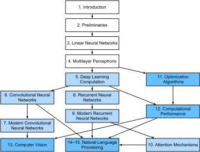

# Kata Pengantar

Hanya beberapa tahun yang lalu, tidak ada banyak ilmuwan yang belajar secara mendalam
mengembangkan produk dan layanan cerdas di perusahaan dan rintisan besar.
Ketika yang termuda di antara kita (penulis) masuk ke bidang ini,
*machine learning* tidak menjadi berita utama di surat kabar harian.
Orang tua kami tidak tahu apa itu *machine learning*,
apalagi mengapa kita lebih memilih bidang ini dibanding karir di bidang kedokteran atau hukum.
*Machine learning* adalah disiplin akademis berwawasan ke depan
dengan terapan dunia nyata yang sempit.
Dan terapan-terapan tersebut, misalnya, pengenalan ucapan dan visi komputer,
membutuhkan begitu banyak pengetahuan spesifik sehingga sering dianggap
sebagai area yang sepenuhnya terpisah di mana *machine learning* merupakan salah satu komponen kecilnya.
Pada saat itu, *neural network*, pendahulu dari model *deep learning*
yang kami fokuskan di buku ini, dianggap sebagai alat yang ketinggalan zaman.

Hanya dalam lima tahun terakhir, *deep learning* telah mengejutkan dunia,
mendorong kemajuan pesat dalam berbagai bidang seperti visi komputer,
pemrosesan bahasa alami, pengenalan ucapan otomatis,
*reinforcement learning*, dan pemodelan statistik.
Dengan kemajuan-kemajuan ini, kita sekarang dapat membuat mobil swa-kemudi
dengan lebih banyak otonomi daripada sebelumnya (dan lebih sedikit otonomi
dari beberapa perusahaan yang mungkin Anda percayai),
sistem penjawab cerdas yang secara otomatis membuat draf email paling umum,
membantu orang-orang dari masalah *inbox* email yang sangat besar,
dan agen perangkat lunak yang mendominasi pemain terbaik dunia
di permainan papan seperti Go, suatu prestasi yang pernah dianggap akan datang beberapa dekade lagi.
Alat-alat ini telah memberikan dampak yang lebih luas pada industri dan masyarakat,
mengubah cara pembuatan film, diagnosis penyakit,
dan memainkan peran yang lebih luas dalam ilmu pengetahuan dasar --- dari astrofisika hingga biologi.

## Tentang Buku Ini

Buku ini adalah upaya kami untuk membuat *deep learning* mudah didekati,
mengajari Anda konsep, konteks, dan kode.

### Satu Media Menggabungkan Kode, Matematika, dan HTML

Agar teknologi komputasi apa pun mencapai dampak penuhnya,
teknologi tersebut harus dipahami dengan baik, didokumentasikan dengan baik, dan didukung oleh
alat yang matang dan terawat dengan baik.
Ide-ide utama harus disaring dengan jelas,
meminimalkan waktu orientasi yang diperlukan untuk memutakhirkan praktisi baru.
Kode pustaka yang matang harus mengotomatiskan tugas-tugas umum,
dan kode contoh harus memudahkan praktisi
untuk mengubah, menerapkan, dan memperluas aplikasi umum agar sesuai dengan kebutuhan mereka.
Lihat aplikasi web dinamis sebagai contoh.
Meskipun ada banyak perusahaan, seperti Amazon,
mengembangkan aplikasi web berbasis database yang sukses di tahun 1990-an,
potensi teknologi ini untuk membantu wirausahawan kreatif
telah direalisasikan ke tingkat yang jauh lebih besar dalam sepuluh tahun terakhir,
sebagian karena pengembangan *framework* yang kuat dan terdokumentasi dengan baik.

Menguji potensi *deep learning* menghadirkan tantangan unik
karena setiap aplikasi menyatukan berbagai disiplin ilmu.
Menerapkan *deep learning* membutuhkan pemahaman semua hal berikut
(i) motivasi untuk memodelkan masalah dengan cara tertentu;
(ii) matematika dari suatu pendekatan pemodelan;
(iii) algoritma optimasi untuk menyesuaikan model dengan data;
dan (iv) teknik yang diperlukan untuk melatih model secara efisien,
menghindari masalah komputasi numerik
dan memaksimalkan perangkat keras yang tersedia.
Mengajar keterampilan berpikir kritis yang dibutuhkan untuk merumuskan masalah,
matematika untuk menyelesaikannya, dan perangkat lunak untuk mengimplementasi
solusinya, semua di satu tempat, menghadirkan tantangan yang berat.
Tujuan kami dalam buku ini adalah untuk menyajikan sumber daya lengkap 
untuk mempercepat proses belajar para calon praktisi.

Pada saat kami memulai proyek buku ini,
tidak ada sumber daya yang 
(i) mutakhir; (ii) membahas lengkap 
*machine learning* moderen dengan kedalaman teknis yang mendalam;
dan (iii) menyajikan jalinan buku teks menarik dan berkualitas dengan kode yang bersih dan dapat dijalankan yang biasanya ditemukan dalam kelas *hands-on*.
Kami menemukan banyak contoh kode untuk
bagaimana menggunakan kerangka *deep learning* yang diberikan
(misalnya, cara melakukan komputasi numerik dasar dengan matriks di TensorFlow)
atau untuk menerapkan teknik tertentu
(misalnya, cuplikan kode untuk LeNet, AlexNet, ResNets, dll)
tersebar di berbagai tulisan blog dan repositori GitHub.
Namun, contoh ini biasanya difokuskan pada
bagaimana mengimplementasikan suatu pendekatan tertentu,
tetapi tidak menjelaskan mengapa keputusan algoritmik tertentu dibuat.
Sementara beberapa sumber daya interaktif muncul secara sporadis
untuk membahas topik tertentu, misalnya, tulisan blog yang menarik
dipublikasikan di situs web [Distill] (http://distill.pub), atau blog pribadi,
mereka hanya membahas topik terpilih dalam *deep learning*,
dan sering kali tidak mengandung kode.
Di sisi lain, sementara beberapa buku teks telah muncul,
terutama: cite: `Goodfellow.Bengio.Courville.2016`,
yang menawarkan survei komprehensif tentang konsep di balik *deep learning*,
namun sumber daya ini tidak menjembatani konsep dan implementasi konsep dalam kode,
terkadang membuat pembaca tidak mengerti bagaimana menerapkan konsep-konsep tersebut.
Selain itu, terlalu banyak sumber daya yang tersembunyi di balik tembok 
penyedia kursus komersial.

Kami mulai untuk membuat sumber daya yang bisa
(i) tersedia secara bebas untuk semua orang;
(ii) menawarkan kedalaman teknis yang cukup untuk memberikan titik awal dari perjalanan
untuk benar-benar menjadi ilmuwan *machine learning* terapan;
(iii) menyertakan kode yang dapat dijalankan, menunjukkan kepada pembaca *bagaimana* memecahkan masalah dalam praktik;
(iv) memungkinkan pemutakhiran cepat, baik oleh kami dan juga oleh komunitas pada umumnya;
dan (v) dilengkapi dengan [forum] (http://discuss.d2l.ai)
diskusi interaktif tentang detail teknis dan forum untuk menjawab pertanyaan.

Tujuan-tujuan ini seringkali bertentangan.
Persamaan, teorema, dan kutipan paling baik dikelola dan dituliskan di LaTeX.
Kode paling baik dijelaskan dengan Python.
Dan halaman web secara bawaan adalah dalam HTML dan JavaScript.
Selanjutnya, kami ingin kontennya
dapat diakses baik sebagai kode yang dapat dieksekusi, sebagai buku fisik,
sebagai PDF yang dapat diunduh, dan di Internet sebagai situs web.
Saat ini tidak ada alat dan alur kerja yang cocok untuk tuntutan ini, jadi kami harus mengumpulkannya sendiri.
Kami menjelaskan pendekatan kami secara detail di: numref: `sec_how_to_contribute`.
Kami memilih GitHub untuk membagikan sumber dan mengizinkan pengeditan,
Notebook Jupyter untuk menuliskan kode, persamaan dan teks,
*Sphinx* sebagai mesin *rendering* untuk menghasilkan banyak keluaran,
dan *Discourse* untuk forum.
Meskipun sistem kami belum sempurna,
pilihan ini memberikan kompromi yang baik di antara pilihan-pilihan ini.
Kami yakin ini mungkin buku pertama yang diterbitkan
menggunakan alur kerja terintegrasi seperti ini.

### Belajar dengan Berbuat

Banyak buku teks mengajarkan serangkaian topik, masing-masing dengan detail yang lengkap.
Misalnya, buku teks Chris Bishop yang sangat bagus: cite: `Bishop.2006`,
mengajarkan setiap topik dengan sangat dalam, sehingga membacanya sampai ke bab
pada regresi linier membutuhkan usaha yang tidak sedikit.
Walaupun para ahli menyukai buku ini karena kedetailannya,
namun untuk pemula, ini malah akan membatasi kegunaannya sebagai teks pengantar.

Dalam buku ini, kami akan mengajarkan sebagian besar konsep pada saatnya (*just in time*).
Dengan kata lain, Anda akan mempelajari suatu konsep tepat di saat konsep tersebut memang dibutuhkan untuk mencapai tujuan praktis tertentu.
Sementara kami meluangkan waktu di awal untuk mengajar
pendahuluan dasar, seperti aljabar linier dan probabilitas,
kami ingin Anda merasakan kepuasan melatih model pertama Anda
sebelum memikirkan tentang distribusi probabilitas yang lebih rumit.

Selain dari beberapa *notebook* awal yang menyediakan kursus kilat
tentang matematika dasar,
setiap bab berikutnya memperkenalkan konsep-konsep baru 
dan menyediakan satu contoh mandiri --- menggunakan *dataset* nyata.
Ini menghadirkan tantangan organisasi.
Beberapa model mungkin secara logis dikelompokkan dalam satu *notebook*.
Dan beberapa ide mungkin paling baik diajarkan dengan menjalankan beberapa model secara berurutan.
Di sisi lain, ada keuntungan besar untuk mengikuti
kebijakan *satu contoh untuk satu notebook*:
Ini membuatnya semudah mungkin bagi Anda untuk 
memulai proyek penelitian Anda sendiri dengan memanfaatkan kode kami.
Cukup salin sebuah *notebook* dan mulailah memodifikasinya.

Kami akan menjalin kode yang dapat dijalankan dengan materi latar sesuai kebutuhan.
Pada umumnya kita akan cenderung membuat perkakas tersedia dulu sebelum menjelaskannya sepenuhnya (dan kami akan menindaklanjutinya hingga menjelaskan latar belakangnya nanti).
Misalnya, kita mungkin menggunakan *stochastic gradient descent*
sebelum menjelaskan sepenuhnya mengapa ini berguna atau mengapa itu berhasil.
Ini membantu memberi praktisi amunisi untuk menyelesaikan masalah dengan cepat,
namun memerlukan kepercayaan pembaca atas beberapa pilihan.

Buku ini akan mengajarkan konsep *deep learning* dari awal.
Terkadang, kami ingin masuk ke dalam detail model
yang biasanya disembunyikan dari pengguna
oleh abstraksi rumit dari *framework* *deep learning*.
Ini muncul terutama di tutorial dasar,
di mana kami ingin Anda memahami semua
yang terjadi di suatu *layer* atau *optimizer*.
Dalam hal ini, kami akan sering menyajikan dua versi contoh:
di satu versi kami mengimplementasi semuanya dari awal,
hanya mengandalkan antarmuka NumPy dan diferensiasi otomatis,
dan versi contoh lain yang lebih praktis,
tempat kami menulis kode ringkas menggunakan API tingkat tinggi dari *framework* *deep learning*.
Setelah kami mengajari Anda cara kerja beberapa komponen,
kita bisa menggunakan API tingkat tinggi di tutorial berikutnya.

### Konten dan Struktur

Buku ini secara umum dapat dibagi menjadi tiga bagian,
yang disajikan dengan warna berbeda di: numref: `fig_book_org`:

:label:`fig_book_org`

* Bagian pertama mencakup dasar-dasar dan pendahuluan.
: numref: `chap_introduction` menawarkan pengantar *deep learning*.
Kemudian, di: numref: `chap_preliminaries`,
kami dengan cepat mengajarkan tentang prasyarat yang diperlukan
untuk praktik langsung *deep learning*, seperti cara menyimpan dan memanipulasi data,
dan bagaimana menerapkan berbagai operasi numerik berdasarkan konsep dasar
dari aljabar linier, kalkulus, dan probabilitas.
: numref: `chap_linear` dan: numref:` chap_perceptrons`
mencakup konsep dan teknik paling dasar dari *deep learning*,
seperti regresi linier, perceptron multi lapis dan regularisasi.

* Lima bab berikutnya berfokus pada teknik *deep learning* moderen.
: numref: `chap_computation` menjelaskan berbagai komponen kunci dari kalkulasi *deep learning* 
dan meletakkan dasar bagi kami untuk kemudian mengimplementasikan model yang lebih kompleks.
Selanjutnya, di: numref: `chap_cnn` dan: numref:` chap_modern_cnn`,
kami memperkenalkan *convolutional neural network* (CNN), alat canggih
yang menjadi tulang punggung sistem visi komputer moderen.
Selanjutnya, di: numref: `chap_rnn` dan: numref:` chap_modern_rnn`, kami perkenalkan
*recurrent neural network* (RNN), model yang mengeksploitasi
struktur temporal atau sekuensial dalam data, dan biasanya digunakan
untuk pemrosesan bahasa alami dan prediksi deret waktu.
Dalam: numref: `chap_attention`, kami memperkenalkan kelas model baru
yang menggunakan teknik yang disebut mekanisme perhatian (*attention mechanism*)
yang baru-baru ini mulai menggantikan RNN dalam pemrosesan bahasa alami.
Bagian ini akan membantu Anda mengetahui dengan cepat alat dasar 
di balik sebagian besar aplikasi moderen dari *deep learning*.

* Bagian tiga membahas tentang skalabilitas, efisiensi, dan aplikasi.
Pertama, dalam: numref: `chap_optimization`,
kami membahas beberapa algoritma optimasi yang umum
digunakan untuk melatih model *deep learning*.
Bab berikutnya,: numref: `chap_performance` membahas beberapa faktor kunci
yang memengaruhi performa komputasi kode *deep learning* Anda.
Dalam: numref: `chap_cv`,
kami menggambarkan
aplikasi utama *deep learning* dalam visi komputer.
Dalam: numref: `chap_nlp_pretrain` dan: numref:` chap_nlp_app`,
kami menunjukkan bagaimana melakukan *pre-training* untuk model representasi bahasa dan menerapkannya
untuk tugas pemrosesan bahasa alami.

